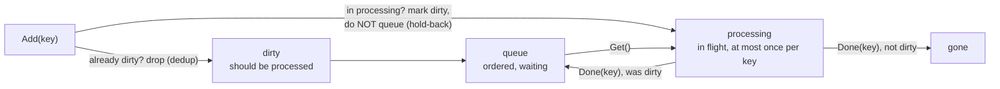
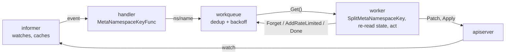

# Controllers

Everything so far has been a part. [Informers](../informers/) cached the world,
[workqueue](../workqueue/) handled failure, [watch](../watch/) delivered
changes. This topic bolts them together into the thing they were always for: a
process that observes desired state, compares it with actual state, and acts —
forever, idempotently, and without ever assuming it saw every event.

The skeleton is small and always the same: **informer → key → queue → worker**.
What makes it correct is not the wiring but two commitments. Enqueue a *key*,
never an object, so the worker acts on what is true now rather than on a
snapshot. And run exactly one instance that acts, however many replicas exist,
which is what leader election is for — and where three duration knobs have to
satisfy inequalities that the library will refuse to build past.

## 1. The queue's three collections

```go
item, shutdown := q.Get() // marks the item as being processed
// …
q.Done(item)              // releases it; a copy re-added meanwhile is now deliverable
```

The contract from [workqueue](../workqueue/) falls out of three internal sets:



```ascii
  Add(key):  in dirty?       -> drop                       (dedup)
             in processing?  -> mark dirty, do NOT queue   (hold-back)
             otherwise       -> dirty + queue

  Get():     pop queue -> processing
  Done(key): leave processing; if it went dirty meanwhile, queue it NOW

  Get("a"), Add("a"), Done("a")   ->  a, b, a
  Get("a"), Add("a"),  <no Done>  ->  a, b, <blocks forever>
```

A key is in `processing` at most once, which is what makes N workers on one
queue safe: no two ever reconcile the same object concurrently, and your
reconcile needs no locking. It is also what collapses a storm — an object
updated fifty times during one slow reconcile produces exactly **one** more
delivery.

The consequence is that a missing `Done` does not crash, log, or block anything
visible. It silently removes one object from the controller's attention
forever. Hence `defer q.Done(key)` on the line after `Get`, so a panic in
reconcile cannot strand the key either.

Note the shutdown protocol: `q.Get()` returns `(zero, true)` once `ShutDown`
has been called and the queue is drained. That boolean is the worker's exit
signal, not an error.

## 2. The skeleton

```go
AddFunc: func(obj any) {
	key, err := cache.MetaNamespaceKeyFunc(obj) // "namespace/name"
	if err != nil {
		return
	}
	q.Add(key)
},
// …
namespace, name, err := cache.SplitMetaNamespaceKey(key) // back apart
_, err = cs.CoreV1().Pods(namespace).Patch(ctx, name, /* … */)
```



```ascii
   apiserver ──watch──> informer ──event──> handler ──"ns/name"──> workqueue
       ^                                                              │
       │                                                            Get()
       │                                                              v
       └──────────── Patch / Apply ────────────────────────────── worker
                                        (re-reads current state, then acts)
```

The handler's job is tiny: turn the object into a key, enqueue it, return. All
real work happens on the worker side, off the informer's goroutine.
`MetaNamespaceKeyFunc` builds the key and `SplitMetaNamespaceKey` reverses it;
using the pair keeps the format in one place and handles the cluster-scoped
case correctly. Enqueue a bare `pod.Name` and it splits to `namespace: ""`,
which builds a cluster-wide URL a namespaced `Patch` cannot use.

Enqueueing a **key** rather than the object is the decision that defines
Kubernetes controllers. Keys deduplicate, and by the time the worker runs it
re-reads current state — so it acts on what is true *now*, not on a snapshot
from whenever the event fired. That is level-triggered reconciliation, and it
is why controllers survive missed events, restarts and out-of-order delivery.

The startup order is not negotiable:

1. Build the informers — **before** `Start`.
2. Register handlers — also before `Start`.
3. `factory.Start(stopCh)`, then `cache.WaitForCacheSync(...)`.
4. Run N workers, each looping `Get` → reconcile →
   `Done` / `Forget` / `AddRateLimited`.

Reconcile with `Patch` where you can — no `resourceVersion`, no 409, no retry
loop — and reach for [Server-Side Apply](../ssa/) when you need to own a whole
block of fields. And handle the object being **gone**: a lister returning
`IsNotFound` means it was deleted, which is a normal reconcile outcome (clean
up, return nil), not an error to retry.

## 3. Leader election, and the two inequalities

```go
LeaseDuration:   15 * time.Second, // must be > RenewDeadline
RenewDeadline:   10 * time.Second, // must be > RetryPeriod * 1.2
RetryPeriod:     2 * time.Second,
ReleaseOnCancel: true,
```

Run three replicas for availability and only one must *act*, or they fight over
the same objects. The mechanism is a single `coordination.k8s.io/v1` Lease
holding `holderIdentity` and `renewTime`: whoever can write it leads.

The three durations describe one clock seen from two sides:

- **LeaseDuration** — how long a lease stays valid after its last renewal. A
  *challenger* waits this long without seeing a renewal before declaring the
  seat vacant.
- **RenewDeadline** — how long the *incumbent* keeps trying to renew before
  giving up and calling `OnStoppedLeading`.
- **RetryPeriod** — how often either retries its API call.

```ascii
  incumbent  ──renew──renew──X (network gone)
                              │<── RenewDeadline (10s) ──>│ OnStoppedLeading
                              │<──────── LeaseDuration (15s) ────────>│
  challenger                                                          takes over

  Safety: the incumbent MUST stop before anyone may take over.
          LeaseDuration > RenewDeadline.  Invert it and two controllers act.
```

`NewLeaderElector` enforces exactly two inequalities:

```go
if lec.LeaseDuration <= lec.RenewDeadline {
	return nil, fmt.Errorf("leaseDuration must be greater than renewDeadline")
}
if lec.RenewDeadline <= time.Duration(JitterFactor*float64(lec.RetryPeriod)) {
	return nil, fmt.Errorf("renewDeadline must be greater than retryPeriod*JitterFactor")
}
```

`JitterFactor` is `1.2`, so the second rule is not simply
`RenewDeadline > RetryPeriod`: retries are jittered up to 20% late and the
deadline must clear the *worst case*.

`OnStoppedLeading` must **terminate the process**, or at minimum stop every
reconcile loop, and do it fast. Losing the lease usually means you were
partitioned or stalled — another replica is already leading, and anything you
do from here is a second writer. The conventional body is
`klog.Fatal("lost leadership")`; let the orchestrator restart you as a
candidate.

`ReleaseOnCancel: true` makes a clean shutdown *clear* the lease rather than
letting it expire, so failover on a rolling update takes milliseconds instead
of a full `LeaseDuration`. The 15s / 10s / 2s here are
kube-controller-manager's own defaults. Shorter fails over faster but tolerates
less latency — too short and a GC pause costs you leadership you still held.

This is a **general** distributed lock, not a controller-only tool.
`resourcelock.LeaseLock` is the modern lock type; the ConfigMap and Endpoints
locks are deprecated.

## Gotchas

- **A missing `Done` retires that key permanently.** No error, no log.
- **`q.Get()`'s second return is "shut down", not "error".**
- **Enqueue keys, never objects.** An object in a queue is a stale snapshot by
  the time it is popped.
- **A bare name splits to an empty namespace.** Namespaced writes then address
  the wrong URL.
- **Materialise informers and register handlers before `Start`.**
- **`IsNotFound` in a reconcile is a normal outcome**, not a retryable error.
- **`LeaseDuration` must exceed `RenewDeadline`.** Inverted, two controllers
  act at once — the exact thing the mechanism prevents.
- **`RenewDeadline` must clear `RetryPeriod × 1.2`.** Jitter is part of the
  contract.
- **`OnStoppedLeading` that keeps working is a second writer.** Exit.

## The exercises

- **ctrl1** — drive the `Get`/`Done` contract directly and watch a re-add be
  held back until the key is released.
- **ctrl2** — assemble a whole controller: informer, key, queue, worker, patch.
- **ctrl3** — configure leader election with durations that satisfy both
  inequalities.

## Source references

- [sample-controller](https://github.com/kubernetes/sample-controller) — the
  canonical skeleton this chapter describes
- [`util/workqueue/queue.go`](https://github.com/kubernetes/client-go/blob/master/util/workqueue/queue.go)
  — `dirty`, `processing`, and the hold-back
- [`tools/cache`](https://pkg.go.dev/k8s.io/client-go/tools/cache) —
  `MetaNamespaceKeyFunc`, `SplitMetaNamespaceKey`
- [Controllers](https://kubernetes.io/docs/concepts/architecture/controller/)
- [`tools/leaderelection`](https://pkg.go.dev/k8s.io/client-go/tools/leaderelection)
  and [`leaderelection.go`](https://github.com/kubernetes/client-go/blob/master/tools/leaderelection/leaderelection.go)
  — where both inequalities are checked
- [Leases](https://kubernetes.io/docs/concepts/architecture/leases/) ·
  [`resourcelock`](https://pkg.go.dev/k8s.io/client-go/tools/leaderelection/resourcelock)
