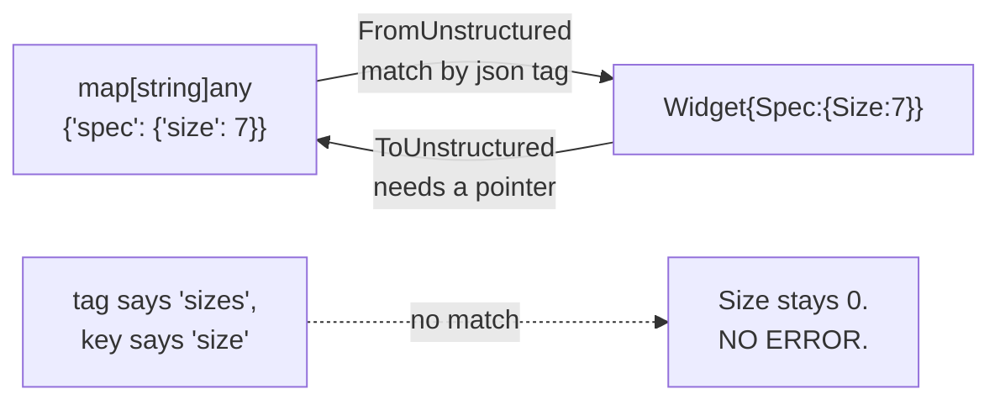

# CRDs

[Dynamic](../dynamic/) left you holding a `map[string]any`. That is fine at the
edges of a program and miserable in the middle of one: no field names, no
compiler, no completion, and `int64` assertions everywhere. The usual answer is
code generation, which means a build step and generated clients per CRD. This
topic is the pragmatic middle ground — `runtime.DefaultUnstructuredConverter`,
which moves between unstructured maps and ordinary Go structs in both
directions, driven entirely by `json` struct tags.

The two directions have opposite failure characters, and that asymmetry is the
whole lesson. Reading in, a mismatched tag is *silent* — you get a zero value
and no error. Writing out, an unrepresentable type is *loud*. Meanwhile the
field that decides whether the object is routable at all, `TypeMeta`, is one
the typed clientset fills in for you and the dynamic client never does.

These exercises need no cluster: they are pure conversion.

## 1. The converter matches by `json` tag

```go
type WidgetSpec struct {
	Size int64 `json:"size"` // must equal the key in the unstructured map
}

var w Widget
err := runtime.DefaultUnstructuredConverter.FromUnstructured(u, &w)
```

The converter walks the map and your struct in parallel, matching by `json`
tag — the same rules `encoding/json` uses, minus the serialisation round-trip
(it is reflection over the map, which is why it beats marshal-then-unmarshal).



```ascii
  map[string]any  ──FromUnstructured──>  Go struct     (match by json tag)
       ^                                     │
       └──────────ToUnstructured─────────────┘         (needs a *pointer)

  json:"sizes"  vs  map key "size"
       -> no match -> Size keeps its zero value -> NO ERROR RETURNED
```

That is the hazard: a mismatched tag is not a decode failure, it is a missing
field — exactly as a JSON document without that key would be. Nothing tells
you.

`metav1.TypeMeta` is embedded with `json:",inline"`, so `apiVersion` and `kind`
land on the *outer* object rather than nesting, which is how `w.Kind` gets
populated from the top-level `"kind"` key. And the same `int64` rule from
[dynamic](../dynamic/) applies: JSON has one numeric type, so a map holding an
`int` where the struct wants `int64` is an error.

All the ordinary `encoding/json` tag rules carry over: `omitempty`, `-` to
skip, and — worth knowing — a field with **no** tag at all is matched by its Go
field name, capital letter included, which almost never matches a Kubernetes
key.

## 2. `TypeMeta` is what the dynamic client routes on

```go
w := Widget{
	TypeMeta:   metav1.TypeMeta{APIVersion: "kubeclientlings.dev/v1alpha1", Kind: "Widget"},
	ObjectMeta: metav1.ObjectMeta{Name: "w1"},
	Spec:       WidgetSpec{Size: 7},
}

m, err := runtime.DefaultUnstructuredConverter.ToUnstructured(&w)
u := &unstructured.Unstructured{Object: m}
```

`ToUnstructured` is the mirror image. It takes a **pointer** — it reflects over
an addressable value — and returns the map, which you wrap in an
`unstructured.Unstructured` to get the accessor methods.

Because `TypeMeta` inlines, setting it puts `apiVersion` and `kind` at the top
level. Leave it zero and, since `TypeMeta`'s fields carry `omitempty`, those
keys simply do not appear: `u.GetKind()` returns `""` and the dynamic client
has nothing to route on. It is schema-blind by design — it does not know what a
Widget is, and `apiVersion` + `kind` in the body are how the server validates
the object against the endpoint you POSTed to.

This is the asymmetry that catches people:

| | typed clientset | dynamic client |
|---|---|---|
| `TypeMeta` on the way out | filled in for you | **you must set it** |
| `TypeMeta` on objects you `Get` | often cleared | present |

So a struct that round-trips fine through the typed path silently loses its
identity on the dynamic path. In real code the GVK comes from a
`runtime.Scheme` rather than hardcoded strings in two places:

```go
gvks, _, err := scheme.ObjectKinds(&w)
u.SetGroupVersionKind(gvks[0])
```

That is what controller-runtime does internally.

`ToUnstructured` produces only JSON-compatible values (`string`, `bool`,
`int64`, `float64`, `map[string]any`, `[]any`). A struct field of a type it
cannot represent is an **error**, not a silent drop — the one place this
direction is louder than the other.

## Gotchas

- **A wrong `json` tag reads as a missing field, not an error.** The struct
  keeps its zero value and nothing complains.
- **A field with no tag matches its Go name**, capital included — almost never
  a Kubernetes key.
- **`ToUnstructured` needs a pointer.** It reflects over an addressable value.
- **Zero `TypeMeta` means no `apiVersion`/`kind` in the map** (`omitempty`), so
  the dynamic client cannot route the object.
- **The typed clientset fills `TypeMeta` in; the dynamic client never does.**
- **Integers are `int64` on the map side.** Both directions.
- **Prefer `scheme.ObjectKinds` over hardcoded GVK strings.**

## The exercises

- **crd1** — convert an unstructured map into a Go struct, and watch a
  mistyped `json` tag produce a zero value with no error.
- **crd2** — convert a struct back, setting the `TypeMeta` the dynamic client
  routes on.

## Source references

- [`runtime.UnstructuredConverter`](https://pkg.go.dev/k8s.io/apimachinery/pkg/runtime#UnstructuredConverter)
  and [`runtime/converter.go`](https://github.com/kubernetes/apimachinery/blob/master/pkg/runtime/converter.go)
  — the reflection walk itself
- [`metav1.TypeMeta`](https://pkg.go.dev/k8s.io/apimachinery/pkg/apis/meta/v1#TypeMeta)
  · [`runtime.Scheme`](https://pkg.go.dev/k8s.io/apimachinery/pkg/runtime#Scheme)
- [`encoding/json` tag rules](https://pkg.go.dev/encoding/json#Marshal) — the
  matching semantics the converter reuses
- [`unstructured`](https://pkg.go.dev/k8s.io/apimachinery/pkg/apis/meta/v1/unstructured)
- [Custom resources](https://kubernetes.io/docs/concepts/extend-kubernetes/api-extension/custom-resources/)
