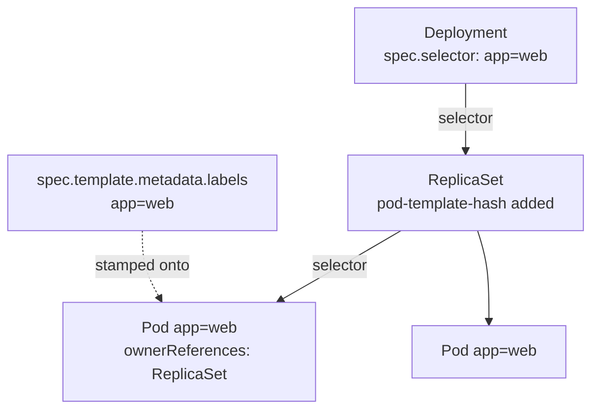
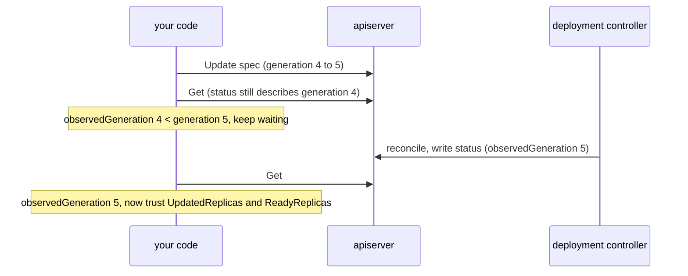

# Deployments

A Pod is a leaf. A Deployment is the first object in this course that is
*managed by a controller*, and that changes what you have to understand.
Nothing you write to a Deployment happens immediately: you record an intention
in `spec`, a controller acts on it, and it reports back in `status`. Reading
that loop correctly — knowing which of the four replica counters answers your
question, and when `status` is even describing the spec you just wrote — is
most of what this topic is about.

The other half is structural: a Deployment does not hold references to its
pods. It finds them by label query, which makes labels a contract rather than
decoration, and makes one particular mistake unfixable after creation.

## 1. The selector/template contract

```go
labels := map[string]string{"app": "web"} // one map, used in both places
Selector: &metav1.LabelSelector{MatchLabels: labels},
Template: corev1.PodTemplateSpec{
	ObjectMeta: metav1.ObjectMeta{Labels: labels},
	// ...
}
```

`spec.selector` is run against pods in the namespace, and whatever matches is
considered owned. `spec.template.metadata.labels` is what the pods it stamps
out will carry. If those disagree, the Deployment creates pods it cannot see,
concludes it still has zero replicas, and creates more — forever. Rather than
let you build that, the API server validates the relationship at admission and
rejects the object with a 422.

Sharing one `labels` variable between the two makes the invariant structural
instead of something you have to remember.



```ascii
  Deployment  spec.selector: app=web
       │  owns via selector (+ pod-template-hash)
       v
  ReplicaSet  spec.selector: app=web,pod-template-hash=abc
       │  owns via selector
       v
  Pod  labels: app=web,pod-template-hash=abc
       ownerReferences: -> ReplicaSet -> Deployment

  spec.template.metadata.labels is what gets stamped onto each Pod.
  If it does not satisfy spec.selector, admission rejects the object (422).
```

`spec.selector` is **immutable** after creation on Deployments, StatefulSets
and DaemonSets. You cannot fix a bad selector with an Update — you delete and
recreate. `MatchLabels` is the equality form; `MatchExpressions` (`In`,
`NotIn`, `Exists`, `DoesNotExist`) is the richer one, and
`metav1.LabelSelectorAsSelector` converts either into the string
`ListOptions.LabelSelector` takes.

## 2. Why so many fields are pointers

```go
replicas := int32(3) // int32, not int — the field is *int32
dep.Spec.Replicas = &replicas
```

`Spec.Replicas` is `*int32` so the API can distinguish three states a plain
`int32` collapses into one: unset (`nil`, server defaults to 1), explicitly
zero (a real and useful request — scale to nothing), and any other value.
Without the pointer, `omitempty` would drop a deliberate `0` from the JSON
entirely.

The same reasoning explains the pointer soup elsewhere:
`TerminationGracePeriodSeconds`, `RunAsNonRoot`, `Optional` on env-var sources
— any field where "not specified" and "the zero value" mean different things.

Go has no implicit numeric conversion and no address-of-literal, which is why
the named-variable dance exists. The generic helpers remove it:

```go
import "k8s.io/utils/ptr"
dep.Spec.Replicas = ptr.To[int32](3)
value := ptr.Deref(dep.Spec.Replicas, 1) // nil-safe read with a default
```

(`ptr.To` supersedes the older `k8s.io/utils/pointer.Int32`.) For scaling
specifically, production code usually goes through the scale subresource rather
than a whole-object Update — see [subresources](../subresources/).

## 3. Merge keys: how a patch identifies a list element

```go
patch := []byte(`{"spec":{"template":{"spec":{"containers":[{"name":"web","image":"nginx:1.28-alpine"}]}}}}`)
_, err := cs.AppsV1().Deployments(ns).Patch(ctx, "web", types.StrategicMergePatchType, patch, metav1.PatchOptions{})
```

Merging a map is unambiguous — keys identify themselves. Merging a list is not:
is `containers[0]` in your patch the same element as `containers[0]` on the
server, or a new one to append? Strategic merge patch answers with a **merge
key** declared in the Go type's struct tags. `PodSpec.Containers` carries
`patchStrategy:"merge" patchMergeKey:"name"`, so elements match by `name`: a
known name merges into that container, a new name appends, and anything you did
not mention is untouched.

Include `"name":"web"` and one container's image changes. Omit it and there is
nothing to match on, so the patch is rejected.

Merge keys are a property of the **built-in Go types**, which is exactly why
strategic merge patch does not work on CRDs. For custom resources use
`MergePatchType`, `JSONPatchType`, or Server-Side Apply — which reads
list-merge behaviour from the OpenAPI schema and therefore does work. That last
route is the modern answer; it is [ssa](../ssa/).

Patching `spec.template` changes the pod-template hash, which is what creates a
new ReplicaSet and starts a rolling update. This patch *is* "deploy a new
version".

## 4. Four replica counters, three questions

```go
if d.Status.ObservedGeneration < d.Generation {
	return false, nil // status is stale — it describes an older spec
}
return d.Status.UpdatedReplicas == replicas && d.Status.ReadyReplicas == replicas, nil
```

| Field | Counts | Answers |
|---|---|---|
| `Status.Replicas` | pods that exist under this Deployment | almost never what you want — includes draining and starting pods |
| `Status.UpdatedReplicas` | pods from the **current** template | has the new version rolled out? |
| `Status.ReadyReplicas` | pods passing readiness | can they serve traffic? |
| `Status.AvailableReplicas` | ready **and** stable for `minReadySeconds` | stricter still |

The generation check comes first, and it is the one people forget.
`metadata.generation` increments on every spec change; the controller copies it
into `status.observedGeneration` once it has acted. Read status before that and
you get the *previous* rollout's numbers, which very often look complete — so
the wait returns instantly and you assert against a version that was never
deployed.



```ascii
  spec change            generation: 4 -> 5
  read status now        observedGeneration = 4   <- STALE, ignore the counters
  controller reconciles  observedGeneration = 5
  read status now        counters describe generation 5, now they mean something
```

This is exactly what `kubectl rollout status` implements, and it generalises:
whenever you poll any `status` block, check `observedGeneration` against
`generation` first, then trust the rest. For failure rather than success, read
`Status.Conditions` — a `Progressing` condition with
`reason: ProgressDeadlineExceeded` is how a wedged rollout announces itself,
and without reading it your wait just runs to timeout with no explanation.

## Gotchas

- **`spec.selector` is immutable.** A wrong selector means delete and recreate,
  not Update.
- **`&int32(3)` and `&3` are both invalid Go.** Hence `ptr.To[int32](3)`.
- **`Status.Replicas` is not "how many are running my new version".** That is
  `UpdatedReplicas`.
- **Status is stale until `observedGeneration` catches up.** Check it first or
  your wait succeeds against the last rollout.
- **A strategic merge patch on a container list needs the merge key.** No
  `name`, no match, rejected.
- **A whole-object Update to change replicas can clobber a concurrent spec
  change.** Prefer the scale subresource.

## The exercises

- **deploy1** — create a Deployment whose selector and template labels actually
  agree, and see the 422 when they do not.
- **deploy2** — scale via `*int32`, and understand why the field is a pointer
  at all.
- **deploy3** — patch a container image with a strategic merge patch, supplying
  the merge key.
- **deploy4** — wait for a rollout properly: generation first, then the right
  replica counter.

## Source references

- [`DeploymentInterface`](https://pkg.go.dev/k8s.io/client-go/kubernetes/typed/apps/v1#DeploymentInterface)
  · [`DeploymentSpec` / `DeploymentStatus`](https://pkg.go.dev/k8s.io/api/apps/v1#DeploymentSpec)
- [Strategic merge patch design doc](https://github.com/kubernetes/community/blob/master/contributors/devel/sig-api-machinery/strategic-merge-patch.md)
  — where merge keys are specified
- [`core/v1/types.go`](https://github.com/kubernetes/api/blob/master/core/v1/types.go)
  — the `patchStrategy` / `patchMergeKey` tags themselves
- [Deployment status](https://kubernetes.io/docs/concepts/workloads/controllers/deployment/#deployment-status)
  and [Progressing conditions](https://kubernetes.io/docs/concepts/workloads/controllers/deployment/#progressing-deployment)
- [`metav1.LabelSelector`](https://pkg.go.dev/k8s.io/apimachinery/pkg/apis/meta/v1#LabelSelector)
  · [`k8s.io/utils/ptr`](https://pkg.go.dev/k8s.io/utils/ptr)
- [Owners and dependents](https://kubernetes.io/docs/concepts/overview/working-with-objects/owners-dependents/)
