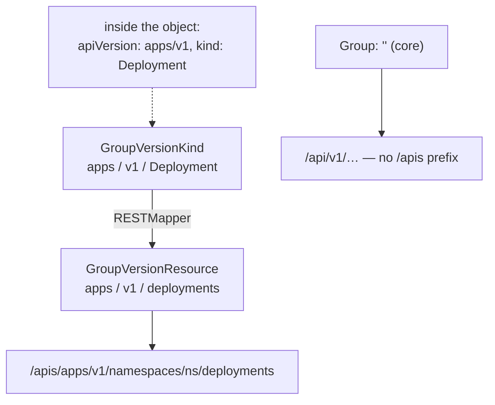
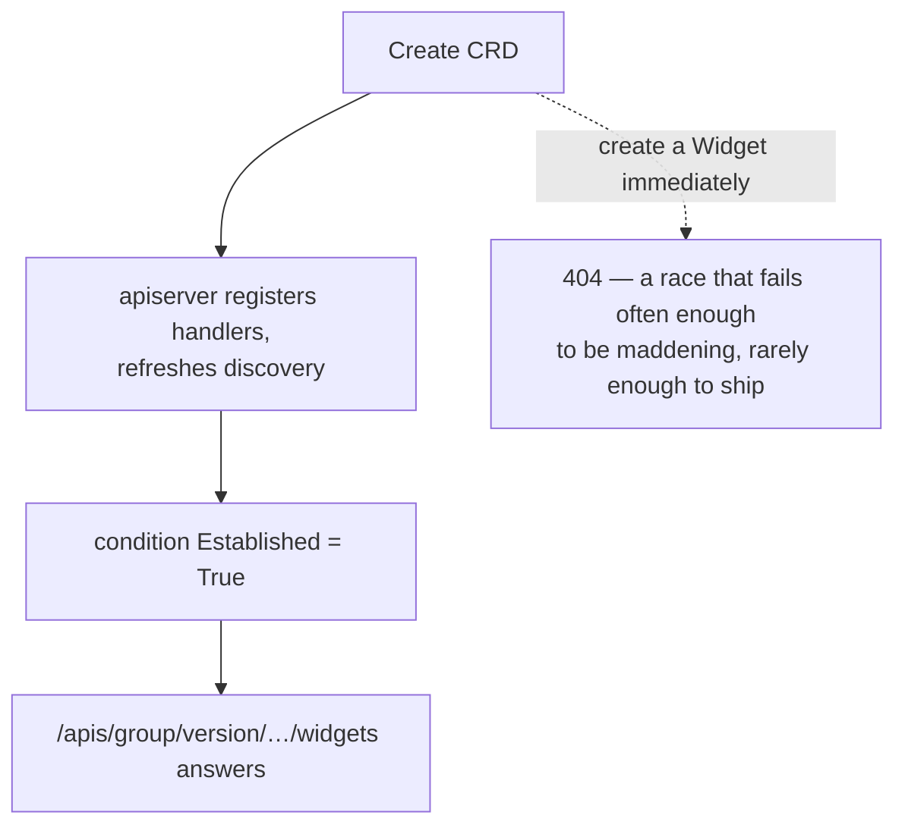

# Dynamic

The typed clientset knows every path at compile time, which is exactly why it
cannot talk to a type invented after it was built. The dynamic client knows
nothing and asks you for everything: you name the endpoint, you get back a
`map[string]any`, and nothing about your type exists in Go at all. That is the
price of working with CRDs, with objects whose type is only known at runtime,
and with anything that has to operate on resources generically — which is to
say, most of the interesting tooling in the ecosystem, `kubectl` included.

Two vocabularies collide here and confusing them produces 404s on URLs nobody
serves. **Kind** names objects; **Resource** names URLs. This chapter starts
there, then covers reading unstructured objects without panicking, defining a
CRD and talking to it, and finally asking the server what it actually serves
instead of guessing.

## 1. Kind names objects, Resource names URLs

```go
gvr := schema.GroupVersionResource{Group: "", Version: "v1", Resource: "pods"}
list, err := dyn.Resource(gvr).Namespace(ns).List(ctx, metav1.ListOptions{})
```

A `GroupVersionResource` is literally the three path components of a Kubernetes
URL. `Resource` is the lowercase plural **path segment** you see in
`/api/v1/namespaces/<ns>/pods`. `Kind` (`Pod`, `Deployment`) is the CamelCase
name that appears **inside** objects, in `kind:` and in Go type names.



```ascii
  GroupVersionKind            RESTMapper           GroupVersionResource
  apps / v1 / Deployment   ───────────────>   apps / v1 / deployments
        │  (appears inside objects:                    │  (appears in URLs)
        │   apiVersion + kind)                         v
        │                                 /apis/apps/v1/namespaces/<ns>/deployments
        └── core group is ""  ->  /api/v1/…    (note: /api, not /apis)
```

`Group: ""` is the **core** group, which lives under `/api/v1`; everything else
lives under `/apis/<group>/<version>`. Results are
`*unstructured.UnstructuredList` — `map[string]any` under the hood with
accessors like `GetKind()`, `GetName()`, `GetLabels()`. No generated structs,
which is precisely why this client works on CRDs it has never heard of.

The plural is not mechanical: `endpoints` is already plural,
`networkpolicies` is not `networkpolicys`, and subresources get their own
segments. Rather than guessing, resolve at runtime with a **RESTMapper**:

```go
mapping, err := mapper.RESTMapping(schema.GroupKind{Group: "apps", Kind: "Deployment"}, "v1")
gvr := mapping.Resource
```

That is how `kubectl` turns `deploy` into `apps/v1/deployments`.
`dyn.Resource(gvr)` without `.Namespace(ns)` is the cluster-scoped or
all-namespaces form, the equivalent of `Pods("")` from [pods](../pods/).

## 2. Reading a `map[string]any` without panicking

```go
msg, found, err := unstructured.NestedString(u.Object, "data", "message")
```

`u.Object` mirrors the object's JSON exactly. Reaching `data.message` by hand
means two type assertions and two nil checks, and one wrong key panics. The
`Nested*` helpers walk the path and return `(value, found, err)`, and the two
failure channels mean different things:

- `found == false` — nothing at that path. **Not an error.** Optional fields
  are normal, so this is the common case.
- `err != nil` — something *is* there but it is the wrong type. A real bug, in
  your code or in the object.

The path is every key from the top of the object down: a ConfigMap has no
top-level `message`, so the full path is `"data", "message"`.

The family is `NestedString`, `NestedBool`, `NestedInt64`, `NestedFloat64`,
`NestedStringMap`, `NestedStringSlice`, `NestedSlice`, `NestedMap` and
`NestedFieldNoCopy`. Note the **Int64**: JSON has one numeric type, so every
integer in an unstructured object is an `int64`. Asking for `int` or `int32` is
a type error, and it is the single most common surprise here.

`NestedMap` and `NestedSlice` **deep-copy** what they return — which is what you
want when the object came from an informer cache, where mutating a cached object
corrupts it for every other consumer. `NestedFieldNoCopy` skips the copy when
you only read and the cost matters. Writing back is
`unstructured.SetNestedField(u.Object, value, "spec", "size")`, which errors
unless the value is a JSON-compatible type.

## 3. A CRD only serves the versions it declares

```go
gvr := schema.GroupVersionResource{Group: "kubeclientlings.dev", Version: "v1alpha1", Resource: "widgets"}

widget := &unstructured.Unstructured{Object: map[string]any{
	"apiVersion": "kubeclientlings.dev/v1alpha1", // must agree with the GVR
	"kind":       "Widget",
	// ...
}}
```

A CRD registers new endpoints on the running API server: `spec.group` +
`spec.names.plural` + each entry in `spec.versions` become paths, and only
versions with `served: true` get a path at all. Asking for `v1` when the CRD
declares `v1alpha1` gives a 404 that reads exactly like "this resource does not
exist" — the server cannot distinguish "wrong version" from "no such resource",
so the error never points at the real cause. When a custom resource seems to
have vanished, read the CRD's `spec.versions`.

The `apiVersion` inside the object is validated against the GVR you send it to;
a mismatch is a 400.



```ascii
  Create CRD ──> apiserver registers handlers + refreshes discovery
                          │
                          v
                 condition Established=True   ──> endpoints answer

  Create a Widget before Established?  ->  404.
  Poll for Established. It is not optional.
```

Exactly one version carries `storage: true` — the one etcd persists; others are
served through conversion. `spec.versions[].schema` is a structural OpenAPI v3
schema and is **required** in `apiextensions.k8s.io/v1`: it validates and
**prunes** unknown fields, so a field the schema does not declare silently
disappears.

CRDs are cluster-scoped and shared, which is why an exercise deletes leftovers
before creating its own — and why deleting a CRD deletes every custom resource
of that type, cluster-wide, without confirmation.

## 4. Ask the server, don't hardcode

```go
resources, err := disco.ServerResourcesForGroupVersion("apps/v1")
for _, r := range resources.APIResources {
	if r.Name == "deployments" { /* r.Kind, r.Namespaced, r.Verbs */ }
}
```

Every API server publishes a machine-readable index of itself: `/api` and
`/apis` list group/versions, `/apis/apps/v1` lists that version's resources.
Each `metav1.APIResource` carries what a generic client needs — `Name` (the
plural path segment), `Kind`, `Namespaced`, `Verbs`, `ShortNames` (`deploy`),
and `Group`/`Version` for resources promoted from elsewhere. This is how
`kubectl get deploy` resolves at all.

Asking for a group/version the server does not serve is an **error**, not an
empty list. `apps/v1beta1` was removed in Kubernetes 1.16, so hardcoding it
fails outright — which is the good outcome. The failure mode to fear is code
that assumes a resource exists and gets a confusing 404 much later.

Useful entry points: `ServerGroups()` (every group and its versions, including
the preferred one), `ServerPreferredResources()` (one entry per resource at the
preferred version — what you want when scanning for everything),
`ServerVersion()`, and checking `Verbs` to feature-detect before calling.

Discovery is chatty — one request per group/version — so client-go ships
`memory.NewMemCacheClient` and a disk-backed cached client, and `RESTMapper` is
usually built on one of those. Modern servers also support **aggregated
discovery**, returning the whole tree in one request.

## Gotchas

- **`Resource` is the URL plural, not the Kind.** `pods`, not `Pod`.
- **`Group: ""` means core, and core lives at `/api`, not `/apis`.**
- **Every integer in an unstructured object is `int64`.** Asking for `int` is a
  type error.
- **`found == false` is not an error.** Check it; do not use the zero value.
- **`NestedFieldNoCopy` hands you the cache's own memory.** Mutating it
  corrupts every other consumer.
- **A CRD is not usable the moment it is created.** Poll for `Established`.
- **Fields not in the CRD's schema are pruned silently.**
- **Deleting a CRD deletes every object of that type, cluster-wide.**
- **A wrong CRD version 404s identically to a missing resource.**

## The exercises

- **dyn1** — address a built-in resource by GVR and see that the path segment,
  not the Kind, is what routes.
- **dyn2** — read nested fields out of an unstructured object, distinguishing
  "absent" from "wrong type".
- **dyn3** — define a CRD, wait for `Established`, and create a custom resource
  through the dynamic client.
- **dyn4** — ask the discovery API what a group/version actually serves.

## Source references

- [`client-go/dynamic`](https://pkg.go.dev/k8s.io/client-go/dynamic) ·
  [`apimachinery/.../unstructured`](https://pkg.go.dev/k8s.io/apimachinery/pkg/apis/meta/v1/unstructured)
- [`schema.GroupVersionResource`](https://pkg.go.dev/k8s.io/apimachinery/pkg/runtime/schema#GroupVersionResource)
  · [Standard API terminology](https://kubernetes.io/docs/reference/using-api/api-concepts/#standard-api-terminology)
- [`api/meta/restmapper.go`](https://github.com/kubernetes/apimachinery/blob/master/pkg/api/meta/restmapper.go)
  — how Kind resolves to Resource
- [Custom resources](https://kubernetes.io/docs/concepts/extend-kubernetes/api-extension/custom-resources/)
  · [CRD versioning](https://kubernetes.io/docs/tasks/extend-kubernetes/custom-resources/custom-resource-definition-versioning/)
  · [`apiextensions/v1` types](https://pkg.go.dev/k8s.io/apiextensions-apiserver/pkg/apis/apiextensions/v1)
- [`client-go/discovery`](https://pkg.go.dev/k8s.io/client-go/discovery) ·
  [API groups](https://kubernetes.io/docs/reference/using-api/#api-groups) ·
  [Deprecated API migration guide](https://kubernetes.io/docs/reference/using-api/deprecation-guide/)
