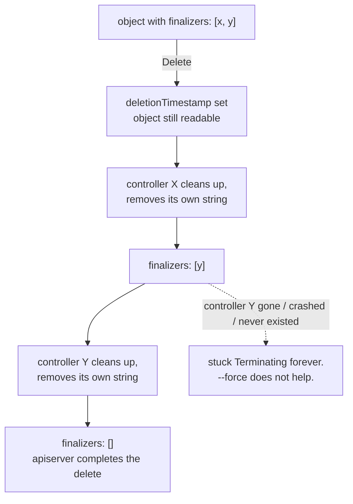

# Finalizers

An operator that allocates something outside the cluster — a cloud load
balancer, a database, a DNS record — has a problem at delete time. The moment a
user deletes the Kubernetes object, the record of what to clean up disappears
with it, and the external resource leaks with nothing left to point at it.

A finalizer is the hook that fixes that, and its mechanism is almost absurdly
simple: `metadata.finalizers` is a list of opaque strings, and the API server's
only rule is *if the list is non-empty, do not remove the object*. Delete then
stops meaning "delete" and starts meaning "mark terminating". The object stays
readable while controllers do their cleanup, and it vanishes when the last
string is removed.

The same simplicity is why objects get stuck terminating forever, which is one
of the most common Kubernetes support questions there is. Nothing in the
cluster will ever remove a finalizer whose controller no longer exists.

## 1. Delete becomes "mark terminating"

```go
cm := &corev1.ConfigMap{ObjectMeta: metav1.ObjectMeta{
	Name:       "guarded",
	Namespace:  ns,
	Finalizers: []string{finalizer}, // "kubeclientlings.dev/protect"
}}
```

A `Delete` on such an object sets `metadata.deletionTimestamp` and returns
success. The object stays fully readable and listable, now terminating: `Get`
returns it, `IsNotFound` is false.



```ascii
  finalizers: [x, y]
        │ Delete
        v
  deletionTimestamp set, object STILL THERE
        │ controller X: cleanup, remove "x"
        v
  finalizers: [y]
        │ controller Y: cleanup, remove "y"
        v
  finalizers: []  ->  apiserver completes the delete, object gone

  If controller Y never removes "y": Terminating forever.
  Not --force, not --grace-period=0. Only editing metadata.finalizers.
```

The server never interprets the strings — it counts them. Each one is a claim
by some controller that it has work to do first.

A namespace stuck `Terminating` is nearly always this, one level down: some
object inside it holds a finalizer nobody will clear.

Conventions worth following:

- **Namespace your finalizer**: `yourdomain.com/name`. `kubernetes.io` and
  `k8s.io` prefixes are reserved, and bare names are rejected on many
  resources.
- **Add it at create time or on first reconcile**, before you allocate anything
  external. Add it after and there is a window where a delete loses the object.
- Adding one is an ordinary metadata write competing with other writers:
  `controllerutil.AddFinalizer` + `Update` inside a `retry.RetryOnConflict`.

## 2. Removing the last one completes the delete

```go
got, err := cs.CoreV1().ConfigMaps(ns).Get(ctx, "guarded", metav1.GetOptions{})
got.Finalizers = nil // cleanup is done — release it
_, err = cs.CoreV1().ConfigMaps(ns).Update(ctx, got, metav1.UpdateOptions{})
```

The delete was already requested and queued; the server is waiting for exactly
one thing. Clearing the list is a normal metadata write, and on seeing the last
finalizer go the server completes the deletion immediately. You never call
`Delete` again.

`= nil` is fine in an exercise and wrong in production. Several controllers can
each hold their own string, and the object goes away when the **last** one is
removed — so each controller removes only its own, or you silently discard
other controllers' claims and delete the object before their cleanup ran.

Every finalizer-using controller has the same two-branch reconcile:

```go
if obj.DeletionTimestamp.IsZero() {
	// normal path: make sure our finalizer is present, then reconcile
	if !controllerutil.ContainsFinalizer(obj, myFinalizer) {
		controllerutil.AddFinalizer(obj, myFinalizer)
		return r.Update(ctx, obj)
	}
	return r.reconcileNormal(ctx, obj)
}

// deletion path
if controllerutil.ContainsFinalizer(obj, myFinalizer) {
	if err := r.cleanupExternalResources(ctx, obj); err != nil {
		return err // keep the finalizer; retry
	}
	controllerutil.RemoveFinalizer(obj, myFinalizer)
	return r.Update(ctx, obj)
}
return nil
```

Two properties fall out of that shape and both matter:

- **Cleanup must be idempotent.** The reconcile may run many times against a
  terminating object; deleting an already-deleted cloud resource has to be a
  no-op, not an error.
- **Only remove the finalizer after cleanup succeeds.** Returning the error
  keeps the finalizer, so the object stays and you get retried. Remove it first
  and the object vanishes along with any record of what you failed to clean up.

## Gotchas

- **A finalizer makes `Delete` non-destructive.** `IsNotFound` stays false;
  poll `deletionTimestamp` instead.
- **Nothing removes a finalizer but a client.** Not `--force`, not
  `--grace-period=0`, not deleting the namespace.
- **`Finalizers = nil` discards other controllers' claims.** Remove only your
  own string.
- **Add the finalizer before allocating external state**, or a delete in the
  gap loses it.
- **Cleanup runs more than once.** Make it idempotent.
- **Removing the finalizer before cleanup succeeds leaks the resource** and
  destroys the evidence.
- **`kubernetes.io/` and `k8s.io/` prefixes are reserved.** Use your own
  domain.

## The exercises

- **fin1** — create an object carrying a finalizer, delete it, and find it
  still there with a `deletionTimestamp`.
- **fin2** — clear the finalizer and watch the queued delete complete
  immediately.

## Source references

- [Finalizers](https://kubernetes.io/docs/concepts/overview/working-with-objects/finalizers/)
  · [Using finalizers to control deletion](https://kubernetes.io/blog/2021/05/14/using-finalizers-to-control-deletion/)
- [`metav1.ObjectMeta`](https://pkg.go.dev/k8s.io/apimachinery/pkg/apis/meta/v1#ObjectMeta)
  — `Finalizers`, `DeletionTimestamp`, `DeletionGracePeriodSeconds`
- [Garbage collection](https://kubernetes.io/docs/concepts/architecture/garbage-collection/)
  — foreground vs background propagation, and how it interacts with finalizers
- [`controllerutil`](https://pkg.go.dev/sigs.k8s.io/controller-runtime/pkg/controller/controllerutil)
  — `AddFinalizer`, `RemoveFinalizer`, `ContainsFinalizer`
- [`registry/rest/delete.go`](https://github.com/kubernetes/apiserver/blob/master/pkg/registry/rest/delete.go)
  — where the server decides between "mark" and "remove"
