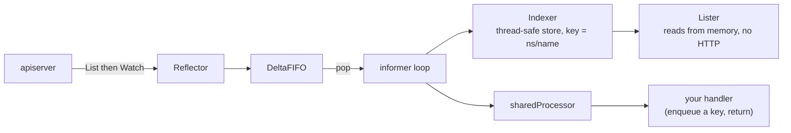

# Informers

[Watch](../watch/) ended with an admission: a raw watch is correct only if you
also implement relisting, reconnection and 410 recovery, and at that point you
have written a `Reflector`. An informer is that `Reflector` plus a local cache
plus a fan-out of event handlers — the layer every controller in Kubernetes is
actually built on, including the ones in the control plane.

The payoff is that a controller reconciling thousands of times a second never
touches the API server to *read*. The cost is a lifecycle with several ordering
rules, and almost every way of getting it wrong produces **no error at all**:
the program compiles, runs, and blocks forever on a channel nobody will send
to. This chapter is mostly about those orderings, and about the two rules —
never mutate a cached object, never do I/O in a handler — that keep the shared
machinery safe.

## 1. What is actually running

```go
factory.Start(ctx.Done()) // launches goroutines, returns immediately

if !cache.WaitForCacheSync(ctx.Done(), podInformer.Informer().HasSynced) {
	exkit.Failf("cache never synced")
}

pods, err := lister.Pods(ns).List(labels.Everything()) // now safe
```



```ascii
  apiserver ──List+Watch──> Reflector ──> DeltaFIFO ──pop──> informer loop
                                                              │       │
                                                              v       v
                                                          Indexer   sharedProcessor
                                                     (store, ns/name)      │
                                                              │            v
                                                              v      your handler
                                                           Lister    (enqueue, return)
                                                    reads memory, no HTTP
```

`Start` spawns those goroutines and returns **immediately**. At that instant
the store is empty, so a read races the initial List and reliably loses.
`HasSynced` flips true once every object from the initial List has been
*processed*, not merely received. `WaitForCacheSync` polls it, and returns
`false` if the stop channel closes first — which is why the return value must
be checked rather than ignored.

`WaitForCacheSync` gives you a **consistent starting point, not freshness**.
Once synced the cache is eventually consistent: it trails the API server by
however long a watch event takes to arrive. Never read-modify-write straight
off a lister — `Get` from the API for a live `resourceVersion`, or be ready for
the 409 from [pods](../pods/).

The `0` in `NewSharedInformerFactory(cs, 0)` is the **resync period**, not a
poll interval. A resync re-delivers everything already in the cache as
synthetic Update events; it does not re-fetch from the server. `0` disables it,
which is what modern controllers want — level-triggered reconciliation makes
the safety net unnecessary.

## 2. Registering a handler starts nothing

```go
_, err := podInformer.Informer().AddEventHandler(cache.ResourceEventHandlerFuncs{
	AddFunc: func(obj any) { /* … */ },
})
// …
factory.Start(ctx.Done())
```

`AddEventHandler` appends a listener to a `sharedProcessor`, allocates its ring
buffer, and returns a handle. That is all: no watch, no HTTP, no goroutines.
`factory.Start` is what launches each informer's `Run` loop. Until then nothing
lists, nothing watches, and no handler can fire — and the failure has no error
message, which is what makes it the classic informer bug.

Register handlers **before** `Start`, or you may miss the initial batch.

During the initial sync every pre-existing object is delivered to `AddFunc`:
the informer does not distinguish "this already existed" from "this was just
created". Your handler must be **idempotent**. That is the deep reason
controllers are *level-triggered* — handlers do not act on the event, they
enqueue a key, and the reconcile loop looks at current state. Then "created"
versus "replayed at startup" stops mattering.

Two more contract details. `obj any` needs a type assertion, and on delete you
may receive a `cache.DeletedFinalStateUnknown` tombstone instead of the object
— the informer telling you it missed the delete and resynced:

```go
if tomb, ok := obj.(cache.DeletedFinalStateUnknown); ok { obj = tomb.Obj }
```

And `UpdateFunc(old, new any)` fires on **every** update, resyncs included;
compare `ResourceVersion` and return early when they match.

Handlers run on the informer's own goroutine, serialised per listener. Blocking
in one blocks that informer's delivery to that listener, so never do I/O in a
handler. Enqueue and return — [workqueue](../workqueue/) is the other half.

## 3. `namespace/name` is the currency

```go
key, err := cache.MetaNamespaceKeyFunc(created) // "my-ns/target"
obj, exists, err := informer.GetStore().GetByKey(key)
```

The store is a map keyed by a string. `MetaNamespaceKeyFunc` returns
`"<namespace>/<name>"` for a namespaced object and just `"<name>"` for a
cluster-scoped one — no leading slash. `GetByKey` returns
`(obj, exists, err)`, and a bare `"target"` is not the key the store used, so
you get `exists == false` and **no error**. Check the boolean.

Use the function rather than `fmt.Sprintf`: it handles the cluster-scoped case,
and it is the *same* function the informer used to store the object.

This string is the universal currency of controllers. Handlers compute it and
push it on a workqueue; the reconcile loop pops it and splits it back with
`cache.SplitMetaNamespaceKey`. That is why controller-runtime's `Reconcile`
takes a `types.NamespacedName` and nothing else. Passing a *key* rather than
the object is deliberate: keys deduplicate in the queue, and by the time you
reconcile you re-read current state instead of acting on a stale snapshot.

Two nearby APIs: `cache.DeletionHandlingMetaNamespaceKeyFunc` unwraps a
tombstone first (use it in delete handlers), and the typed **Lister**
(`lister.Pods(ns).Get(name)`) does the key building and type assertion for you,
returning a proper `NotFound` error.

## 4. Scope the watch, not the read

```go
factory := informers.NewSharedInformerFactoryWithOptions(cs, 0, informers.WithNamespace(ns))
```

A plain factory builds informers whose List+Watch is cluster-wide: the cache
holds every pod in every namespace, and the API server maintains a stream
feeding you all of it. `WithNamespace` is applied to the underlying `ListWatch`,
so the narrowing happens **server-side** — only your namespace's objects are
listed, watched, transferred and stored. Filtering afterwards in Go saves none
of that.

The cost is real: a pod is a few KB of Go structs and a busy cluster has tens
of thousands. Cluster-scoped informers in a controller that cares about one
namespace are a routine cause of multi-gigabyte controller memory, and of
API-server watch load that surfaces as everyone else's latency.

"Shared" is the other half of the story. The factory returns *the same*
informer for the same GVR, so ten controllers asking for pods share one watch
and one cache — but only within a factory. One factory per process (or per
scope) is the rule.

Options compose:

- `informers.WithTweakListOptions(func(o *metav1.ListOptions) { o.LabelSelector = "app=web" })`
  — narrow by label or field selector. With `WithNamespace`, this gets you a
  cache holding *only* what you reconcile.
- `informers.WithTransform(...)` — strip fields you never read (managedFields,
  annotations) before objects enter the cache. Large clusters win a lot here.

The trade-off: a scoped informer's lister can only answer questions about what
it watched. Ask about another namespace and you get an empty result, not an
error.

## 5. Indexes turn a scan into a lookup

```go
err := informer.AddIndexers(cache.Indexers{
	"byTier": func(obj any) ([]string, error) {
		pod, ok := obj.(*corev1.Pod)
		if !ok {
			return nil, nil
		}
		return []string{pod.Labels["tier"]}, nil
	},
})
// … Start, WaitForCacheSync …
frontend, err := informer.GetIndexer().ByIndex("byTier", "frontend")
```

The store is a `cache.Indexer`: the keyed store from section 3 *plus* any
number of secondary indexes, maintained as objects are added, updated and
deleted. `ByIndex(name, value)` is then a map lookup instead of a scan — for
"find every pod owned by this ReplicaSet" on every reconcile, the difference
between O(1) and O(all pods in the cache) on the hottest path a controller has.

The `IndexFunc` returns a **slice** because one object can belong to several
buckets; returning `nil` files it under nothing, which is the clean way to skip
objects the index does not apply to.

The value you file under must be the value you look up. Filing pods under
`pod.Name` and then asking for `"frontend"` returns an empty slice and a `nil`
error — the same quiet miss as a wrong label selector or a wrong cache key.
Check the length, not just the error.

`AddIndexers` must be called **before** the informer starts; afterwards it
returns `informer has already started, can not add indexers`. Objects already
cached were never filed, so the index would be silently incomplete — refusing
is correct, and it is the same discipline as materialising every informer
before `Start`.

client-go ships `cache.NamespaceIndex` for the common case.
controller-runtime exposes the same machinery through
`mgr.GetFieldIndexer().IndexField(...)`, which is what makes
`client.MatchingFields{...}` work.

## Gotchas

- **`Start` returns before anything is cached.** Always `WaitForCacheSync`, and
  check its return value.
- **Materialise every informer before `Start`.** One created afterwards never
  runs — and never says so.
- **Register handlers before `Start`** or miss the initial batch.
- **Never mutate an object from a lister, store or index.** It is a pointer
  into the shared cache. `DeepCopy()` first.
- **Never do I/O in a handler.** It blocks delivery to that listener. Enqueue a
  key and return.
- **Every pre-existing object arrives as `AddFunc`.** Handlers must be
  idempotent.
- **Delete handlers can receive a `DeletedFinalStateUnknown` tombstone.**
- **`UpdateFunc` fires on resyncs with nothing changed.** Compare
  `ResourceVersion`.
- **A lister is eventually consistent.** Never read-modify-write from it.
- **`GetByKey` and `ByIndex` miss quietly.** Check `exists` / the length.
- **Scoped informers answer only about what they watched.** Empty, not an
  error.

## The exercises

- **inf1** — start a factory, wait for the sync, and read from the lister
  instead of the API.
- **inf2** — register an event handler and discover that registering it starts
  nothing.
- **inf3** — build a cache key with `MetaNamespaceKeyFunc` and look the object
  back up.
- **inf4** — scope the List+Watch to one namespace, server-side.
- **inf5** — add a secondary index and query it, filing under the value you
  intend to look up.

## Source references

- [`client-go/informers`](https://pkg.go.dev/k8s.io/client-go/informers) ·
  [`tools/cache`](https://pkg.go.dev/k8s.io/client-go/tools/cache)
- [`tools/cache/shared_informer.go`](https://github.com/kubernetes/client-go/blob/master/tools/cache/shared_informer.go)
  — `sharedProcessor`, `HasSynced`, the handler fan-out
- [`tools/cache/delta_fifo.go`](https://github.com/kubernetes/client-go/blob/master/tools/cache/delta_fifo.go)
  · [`tools/cache/reflector.go`](https://github.com/kubernetes/client-go/blob/master/tools/cache/reflector.go)
- [sample-controller walkthrough](https://github.com/kubernetes/sample-controller/blob/master/docs/controller-client-go.md)
  — the canonical diagram of this machinery
- [Controllers](https://kubernetes.io/docs/concepts/architecture/controller/)
  — why level-triggered
- [`cache.Indexer` / `IndexFunc`](https://pkg.go.dev/k8s.io/client-go/tools/cache#IndexFunc)
  · [controller-runtime `FieldIndexer`](https://pkg.go.dev/sigs.k8s.io/controller-runtime/pkg/client#FieldIndexer)
