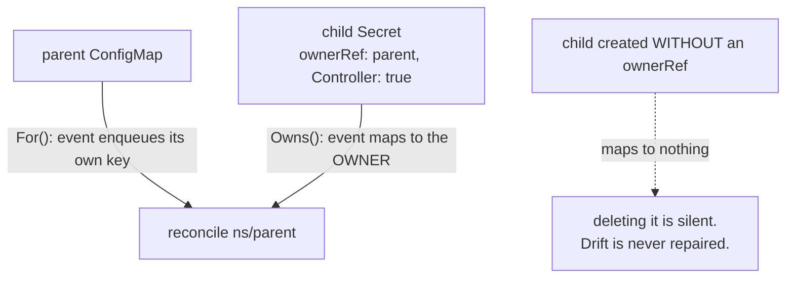
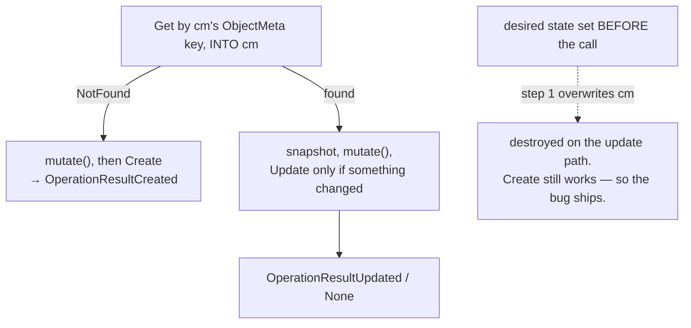

# Operator

[Controllers](../controllers/) had you wire the skeleton by hand: factory,
informers, key function, workqueue, workers, rate limiter, leader election.
Every real operator needs all of it and none of it is where the value is.
controller-runtime owns that machinery so you write one method —
`Reconcile(ctx, req) (ctrl.Result, error)` — and get the rest from a manager.

What survives the abstraction is the thinking. A reconcile still receives a
*key*, not an event, and still has to read current state and make it correct.
Ownership references still route child events back to the parent, so they stop
being bookkeeping and become the routing table. And the helper that looks most
convenient, `CreateOrUpdate`, has a trap that makes creation look perfect while
updates silently never happen.

## 1. The Reconcile contract

```go
var cm corev1.ConfigMap
if err := r.Get(ctx, req.NamespacedName, &cm); err != nil {
	if apierrors.IsNotFound(err) {
		return ctrl.Result{}, nil // gone — nothing left to reconcile
	}
	return ctrl.Result{}, err
}
```

`ctrl.Request` carries a `types.NamespacedName` — the same `namespace/name` key
from [informers](../informers/), already parsed. Rebuilding it by hand
(`types.NamespacedName{Name: req.Name}`) drops the namespace, and a Get with an
empty namespace looks for a cluster-scoped object that does not exist.

The `(ctrl.Result, error)` return is the entire control surface:

| Return | Meaning |
|---|---|
| `{}, nil` | done — do not come back until something changes |
| `{}, err` | failed — requeue with exponential backoff, for free |
| `{RequeueAfter: d}, nil` | come back in `d` regardless (polling external state) |

`IsNotFound` is a **success**, not an error. The object was deleted, the cache
already forgot it, there is nothing to reconcile. Returning the error makes the
manager retry forever on an object that will never exist — a hot loop with
backoff, visible only as rising error counters. `client.IgnoreNotFound(err)` is
the idiomatic one-liner.

Note what Reconcile never does: look at the *event*. It receives a name, reads
current state, and makes it correct. That is why one function handles create,
update, resync and startup without knowing which it is.

Two supporting habits in that code. Patch with
`client.MergeFrom(cm.DeepCopy())` rather than `Update` — no `resourceVersion`,
so a second event arriving mid-reconcile cannot 409 — and the `DeepCopy` is
essential, because `cm` comes from the shared cache and the patch is the diff
between the copy and your mutations. And return early when nothing needs doing:
without that, the write triggers an update event which triggers another
reconcile, which writes again.

## 2. `Owns()` makes ownerRefs the routing table

```go
ctrl.NewControllerManagedBy(mgr).
	For(&corev1.ConfigMap{}).   // reconcile these — request = this object
	Owns(&corev1.Secret{}).     // watch these — request = their OWNER
	Complete(r)
```



```ascii
  For(ConfigMap)   event on a ConfigMap ──> enqueue that ConfigMap's key
  Owns(Secret)     event on a Secret    ──> read its CONTROLLER ownerRef
                                            ──> enqueue owner's key

  Child with no ownerRef -> its events map to nothing.
  Delete it and the controller never notices.
```

`SetControllerReference` fills in APIVersion, Kind, Name, UID **and**
`Controller: true`. It needs the `*runtime.Scheme` to resolve the GVK from the
Go type, which is why the reconciler carries `mgr.GetScheme()`.

`SetControllerReference` and `SetOwnerReference` differ. An object may have many
owner references but at most **one** with `Controller: true`, and
`SetControllerReference` errors if a different controller already claims it.
That single ref is what `metav1.GetControllerOf` returns and what `Owns()`
follows; plain `SetOwnerReference` gives you garbage collection without the
routing.

You get GC for free either way — delete the parent and the child is collected,
per [options](../options/). The interesting direction here is the other one:
delete the *child* and the controller resurrects it, which is exactly how a
Deployment defends its ReplicaSet.

Ownership is namespace-local and cannot cross namespaces or go from
cluster-scoped to namespaced. For cross-namespace or non-ownership
relationships, `Watches()` with a custom `handler.EnqueueRequestsFromMapFunc`
is the escape hatch — you write the mapping yourself.

Tolerate `AlreadyExists` on create: reconciles are re-entrant, so "an earlier
me already made it" is a normal outcome.

## 3. Everything desired goes inside `mutate()`

```go
_, err := controllerutil.CreateOrUpdate(ctx, r.Client, cm, func() error {
	// runs on BOTH paths — cm holds the LIVE object here on the update path
	if cm.Data == nil {
		cm.Data = map[string]string{}
	}
	cm.Data["replicas"] = strconv.Itoa(int(*dep.Spec.Replicas))
	return controllerutil.SetControllerReference(&dep, cm, r.scheme)
})
```

`CreateOrUpdate` does exactly this, in this order:



```ascii
  1. Get into cm            <- OVERWRITES cm with the live object
  2. NotFound?  mutate() -> Create        (OperationResultCreated)
  3. else       mutate() -> Update, only if mutate changed something
                                           (Updated / None)

  Desired state set before the call is destroyed by step 1 on the update path.
  The create path still works. So creation looks perfect and the object
  never updates again: drift is never repaired, a scale-up never mirrored.
```

Putting the mutations inside means they are applied *on top of* whatever the
server currently has — which is what "lay desired state over observed state"
means.

Three rules for a `mutate` function:

- **Idempotent.** It runs every reconcile, and its no-change case is what
  produces `OperationResultNone` and skips the write. Without that, the update
  triggers an event, which triggers a reconcile, which updates again.
- **Never change name or namespace.** This one is enforced: the wrapper
  re-derives the key afterwards and fails with `MutateFn cannot mutate object
  name and/or object namespace`.
- **Set the ownerRef inside too.** It is part of desired state, and the child
  needs it for the `Owns()` routing that drives drift repair.

Touch only fields you own. Wiping `cm.Data` wholesale instead of setting one
key deletes whatever another writer added — the same discipline as
[Server-Side Apply](../ssa/), minus the server-side bookkeeping.
`CreateOrPatch` is the sibling that sends a patch rather than a full update,
which is gentler on objects with several writers.

## Gotchas

- **`IsNotFound` is a normal outcome.** Returning it as an error is a hot loop.
- **Use `req.NamespacedName` as-is.** Reconstructing it drops the namespace.
- **`{}, nil` means "do not come back".** Use `RequeueAfter` for polling.
- **`DeepCopy` before mutating anything from the cache.**
- **A reconcile that always writes reconciles forever.** Return early on
  no-change.
- **A child with no controller ownerRef is invisible to `Owns()`.**
- **At most one `Controller: true` ownerRef per object.**
- **`CreateOrUpdate`'s Get overwrites your object.** All desired state goes
  inside `mutate`.
- **`mutate` may not change name or namespace.** The wrapper enforces it.
- **Tolerate `AlreadyExists`.** Reconciles are re-entrant.

## The exercises

- **op1** — implement `Reconcile` against the manager's client, treating a
  deleted object as success.
- **op2** — set a controller reference so `Owns()` routes child events back to
  the parent, and watch the child get resurrected.
- **op3** — converge with `CreateOrUpdate`, putting every piece of desired
  state inside `mutate`.

## Source references

- [controller-runtime](https://pkg.go.dev/sigs.k8s.io/controller-runtime) ·
  [`reconcile.Reconciler`](https://pkg.go.dev/sigs.k8s.io/controller-runtime/pkg/reconcile)
- [`pkg/controller/controllerutil/controllerutil.go`](https://github.com/kubernetes-sigs/controller-runtime/blob/main/pkg/controller/controllerutil/controllerutil.go)
  — `CreateOrUpdate`, `CreateOrPatch`, `SetControllerReference`
- [`pkg/builder`](https://pkg.go.dev/sigs.k8s.io/controller-runtime/pkg/builder)
  — `For`, `Owns`, `Watches`
- [`pkg/handler`](https://pkg.go.dev/sigs.k8s.io/controller-runtime/pkg/handler)
  — `EnqueueRequestsFromMapFunc`, the escape hatch
- [Operator pattern](https://kubernetes.io/docs/concepts/extend-kubernetes/operator/)
  · [Kubebuilder book](https://book.kubebuilder.io/)
- [Owners and dependents](https://kubernetes.io/docs/concepts/overview/working-with-objects/owners-dependents/)
