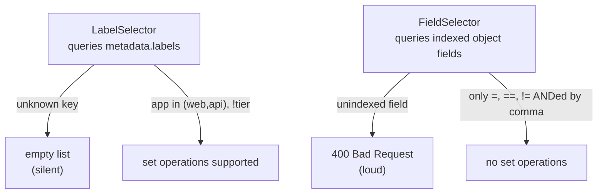
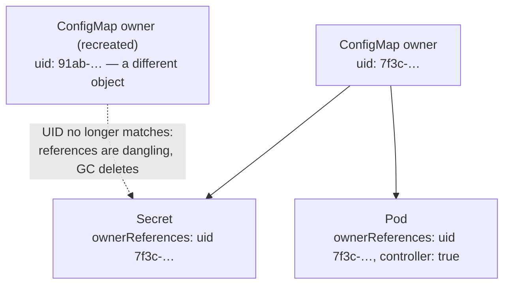

# Options

Every client-go call ends in an options struct, and until now they have mostly
been empty. `ListOptions`, `ApplyOptions`, `DeleteOptions` are where you shape
the request: what to filter on, who you are claiming to be, how much to ask for
at a time. Getting them right is the difference between a controller that a
cluster barely notices and one that operators come looking for.

Two ideas run through the topic. The first is that filtering happens on **two
independent axes** — labels and fields — that look interchangeable and behave
nothing alike, including on typos. The second is **identity**: server-side
apply needs to know who owns each field, and the garbage collector needs to
know exactly which instance owns each object. Both are answered with values you
can only get from the server.

## 1. Build selectors, don't sprintf them

```go
selector := labels.SelectorFromSet(labels.Set{"env": "prod", "tier": "web"})

pods, err := cs.CoreV1().Pods(ns).List(ctx, metav1.ListOptions{
	LabelSelector: selector.String(),
})
```

`labels.Set` is `map[string]string` with methods. `SelectorFromSet` requires
**every** pair — keys are ANDed — and `.String()` renders the canonical
`env=prod,tier=web` with keys sorted. Going through the type means a malformed
key is caught by the parser rather than by the API server, four layers away.

The same `labels.Selector` can also be evaluated **locally** with
`selector.Matches(labels.Set(pod.Labels))`. That is how informer-backed listers
filter without a network call, and why the one type appears in both places —
see [informers](../informers/).

`SelectorFromSet` is equality-only and skips validation for speed. For anything
richer, or anything user-supplied:

```go
req, err := labels.NewRequirement("tier", selection.In, []string{"web", "api"})
selector := labels.NewSelector().Add(*req)

parsed, err := labels.Parse("env=prod,tier in (web,api)") // the other direction
```

## 2. Two axes, two failure modes

```go
pods, err := cs.CoreV1().Pods(ns).List(ctx, metav1.ListOptions{
	FieldSelector: "metadata.name=web-2", // FieldSelector, not LabelSelector
})
```

`LabelSelector` and `FieldSelector` are independent query parameters. Labels
query `metadata.labels`; field selectors query the object's own fields. No pod
carries `metadata.name` *as a label*, so asking for it in `LabelSelector`
matches nothing — and does not error.



```ascii
                 LabelSelector            FieldSelector
  queries        metadata.labels          indexed object fields
  operators      = != in notin exists     = == !=   (comma = AND)
  bad key        empty list  (SILENT)     400 Bad Request  (LOUD)
```

That asymmetry is the thing to internalise. When a list comes back empty and
you expected rows, check that you filtered on the axis you think you did.

Field selectors only work on fields the API server has explicitly indexed for
that resource. For Pods: `metadata.name`, `metadata.namespace`, `spec.nodeName`,
`spec.schedulerName`, `spec.restartPolicy`, `spec.serviceAccountName`,
`status.phase`, `status.podIP`, `status.nominatedNodeName`. Anything else —
`spec.containers[0].image`, say — is a 400. The most useful one in real
controllers is `spec.nodeName=<node>`: it is how the kubelet watches only its
own pods instead of the whole cluster.

Build them with `fields.OneTermEqualSelector("metadata.name", "web-2").String()`
or `fields.AndSelectors(...)`.

## 3. Apply needs an identity

```go
applied, err := cs.CoreV1().Pods(ns).Apply(ctx, pod, metav1.ApplyOptions{
	FieldManager: "kubeclientlings", // mandatory: who owns these fields
})
```

Server-side apply records, per field, **which manager set it**. That
bookkeeping lives in `metadata.managedFields` and is what lets two controllers
edit one object safely. Because ownership is the entire point, an apply with no
manager name is meaningless and the server rejects it — `FieldManager` is
required here in a way it is not on `UpdateOptions`, where client-go derives a
default from the user agent.

The **apply configuration** types (`corev1apply.Pod(...).WithLabels(...)`) are
generated structs where every field is a pointer, so "not set" is
representable. With a plain `corev1.Pod` you cannot distinguish "I don't care"
from "set it to zero", and apply would read your zero values as a claim of
ownership.

Ownership is also how apply **removes** things: if your manager set a field
last time and your next apply omits it, the server sees the release and deletes
the value. That is declarative behaviour `Patch` does not give you — and the
reason an apply must always send the *complete* set of fields you intend to
own, never a partial diff. Use a stable manager name (your controller's), not a
per-run string that orphans fields on every restart. The full treatment,
including conflicts and `Force`, is [ssa](../ssa/).

## 4. Ownership is a UID, not a name

```go
OwnerReferences: []metav1.OwnerReference{{
	APIVersion: "v1",
	Kind:       "ConfigMap",
	Name:       owner.Name,
	UID:        owner.UID, // the server-assigned identity — required
}},
```

The garbage collector walks `metadata.ownerReferences` on every object; when an
owner disappears, everything referencing it is deleted. That is the whole
mechanism behind "delete the Deployment and its ReplicaSets and Pods go too".

All four fields identify the owner, and the `UID` is what pins the exact
*instance*. Names are reusable: delete a ConfigMap and create another with the
same name and it is a different object. Without the UID the GC could not tell
"my owner still exists" from "my owner was replaced", so children would either
survive deletions or be deleted by strangers. You only get a UID from the
server, which is why you create the owner first and read it off the returned
object.



```ascii
  ConfigMap "owner"  uid=7f3c…
       ├── Secret  ownerReferences: {Kind: ConfigMap, Name: owner, UID: 7f3c…}
       └── Pod     ownerReferences: {..., UID: 7f3c…, Controller: true}

  delete + recreate "owner"  ->  uid=91ab…  (same name, different object)
  children still point at 7f3c…  ->  dangling  ->  GC deletes them
```

ownerReferences are **namespace-local**. A namespaced object cannot be owned
across namespaces, and a cluster-scoped object cannot be owned by a namespaced
one. Violating that does not error at admission — the GC simply treats the
reference as dangling and deletes the child.

`Controller: true` marks the *one* owner actively managing the object (at most
one per object; it is what `metav1.GetControllerOf` returns).
`BlockOwnerDeletion: true` makes foreground deletion of the owner wait for this
child. In practice `controllerutil.SetOwnerReference` /
`SetControllerReference` build the struct for you, resolving the GVK from the
scheme.

## 5. Page large lists

```go
cont := ""
for {
	list, err := cs.CoreV1().ConfigMaps(ns).List(ctx, metav1.ListOptions{
		LabelSelector: "paged=yes",
		Limit:         5,
		Continue:      cont,
	})
	// ...
	cont = list.Continue
	if cont == "" {
		break
	}
}
```

`Limit` caps one response; the server returns an opaque **continue token** in
`list.metadata.continue` encoding "resume from this key at this
resourceVersion". Feed it back as `Continue` to resume exactly where you
stopped. An **empty token** means that was the last page — do not try to detect
the end with `len(Items) < limit`, because a page can legitimately come back
short.

All pages are served at the resourceVersion pinned by the *first* request, so
the view is consistent — at the price that the server must keep that revision
available. A paging loop slow enough for the revision to be compacted out of
etcd gets `410 Gone`, detectable with `apierrors.IsResourceExpired`. Recovery is
to start the listing over, or opt into `ResourceVersionMatch: NotOlderThan` and
accept a weaker view.

Set `Limit` on any list that could be large: an unbounded `List` makes the
apiserver materialise and serialise the whole collection in memory, which is
the classic way a well-meaning controller degrades a cluster for everyone.
Informers chunk their initial list automatically, so "use an informer" also
buys you paging. When you only need names and labels, pair paging with the
metadata-only client (`k8s.io/client-go/metadata`), which requests
`PartialObjectMetadata` and drops spec and status on the wire.

## Gotchas

- **A wrong label selector returns an empty list; a wrong field selector
  returns 400.** Same intent, opposite feedback.
- **`metadata.name` is a field, not a label.** So are `spec.nodeName` and
  `status.phase`.
- **`SelectorFromSet` skips validation.** Use `labels.Parse` or
  `ValidatedSelectorFromValidatedSet` on user input.
- **`FieldManager` is mandatory on apply.** And it must be stable across
  restarts.
- **An apply is not a diff.** Omitting a field you previously owned deletes it.
- **An ownerReference without a UID, or across namespaces, is dangling.** The
  GC deletes the child rather than erroring.
- **Never parse or persist a continue token.** It is an opaque server cursor.
- **An unbounded `List` of a large resource is a cluster-wide problem.** Set
  `Limit`.

## The exercises

- **opt1** — build a label selector through the `labels` package instead of
  string formatting, and narrow a list with a second key.
- **opt2** — select by `metadata.name` on the axis that actually indexes it.
- **opt3** — server-side apply with a `FieldManager`, using generated apply
  configurations.
- **opt4** — wire an ownerReference with the server-assigned UID so garbage
  collection works.
- **opt5** — page a list with `Limit` and `Continue`, terminating on the empty
  token.

## Source references

- [`labels`](https://pkg.go.dev/k8s.io/apimachinery/pkg/labels) ·
  [`fields`](https://pkg.go.dev/k8s.io/apimachinery/pkg/fields) ·
  [`selection`](https://pkg.go.dev/k8s.io/apimachinery/pkg/selection)
- [Field selectors](https://kubernetes.io/docs/concepts/overview/working-with-objects/field-selectors/)
  — including which fields are indexed per resource
- [`metav1.ListOptions`](https://pkg.go.dev/k8s.io/apimachinery/pkg/apis/meta/v1#ListOptions)
  · [Retrieving large results in chunks](https://kubernetes.io/docs/reference/using-api/api-concepts/#retrieving-large-results-sets-in-chunks)
- [Server-side apply](https://kubernetes.io/docs/reference/using-api/server-side-apply/)
  · [`applyconfigurations`](https://pkg.go.dev/k8s.io/client-go/applyconfigurations)
- [Owners and dependents](https://kubernetes.io/docs/concepts/overview/working-with-objects/owners-dependents/)
  · [Garbage collection](https://kubernetes.io/docs/concepts/architecture/garbage-collection/)
  · [`metav1.OwnerReference`](https://pkg.go.dev/k8s.io/apimachinery/pkg/apis/meta/v1#OwnerReference)
- [`k8s.io/client-go/metadata`](https://pkg.go.dev/k8s.io/client-go/metadata)
