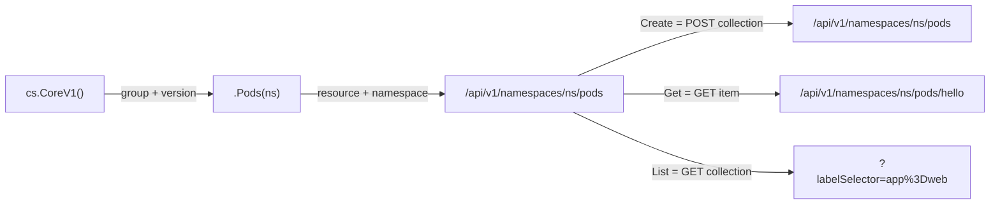
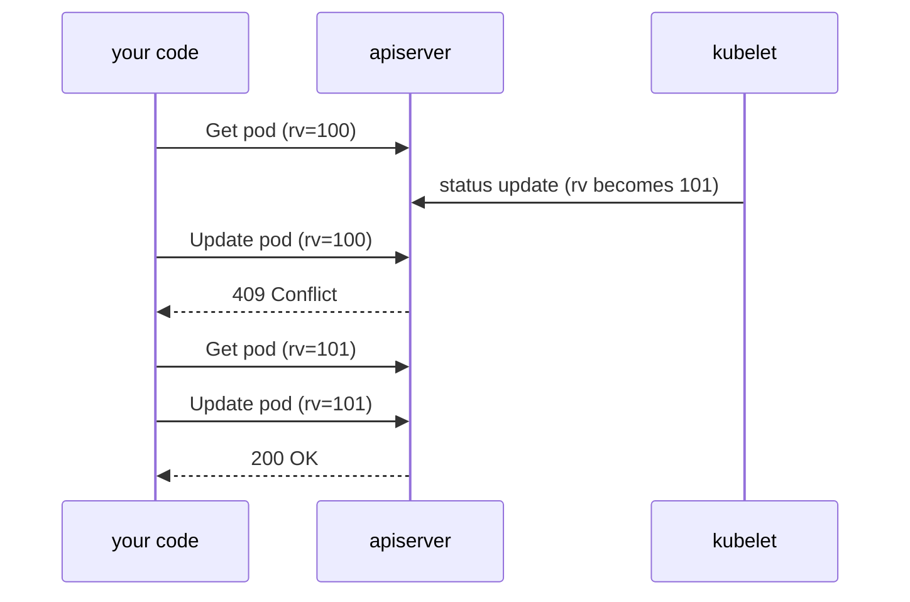
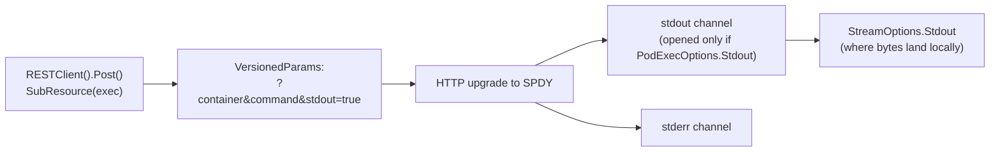

# Pods

[Setup](../setup/) ended with a clientset. This topic is what you do with one:
the full write path against the core/v1 API, using the resource everybody
already understands. Nothing here is Pod-specific — Create, Get, List, Update,
Patch and Delete behave identically for Deployments, ConfigMaps and your own
CRDs. Learn the shapes once.

The typed client is a thin, generated wrapper over a URL. `cs.CoreV1()` picks
the group and version, `.Pods(ns)` picks the resource and namespace, and
together they build `/api/v1/namespaces/<ns>/pods`. Every method on that
interface is one HTTP verb against that path. Once you can see the URL behind
the call, most of client-go's surprises stop being surprising.

## 1. The path is built from the method chain

```go
_, err := cs.CoreV1().Pods(ns).Create(ctx, pod, metav1.CreateOptions{})
got, err := cs.CoreV1().Pods(ns).Get(ctx, "hello", metav1.GetOptions{})
```



```ascii
  cs.CoreV1()  .Pods(ns)          -> /api/v1/namespaces/<ns>/pods
   group/ver   resource+namespace

    Create  POST   /api/v1/namespaces/<ns>/pods
    Get     GET    /api/v1/namespaces/<ns>/pods/hello
    List    GET    /api/v1/namespaces/<ns>/pods?labelSelector=app%3Dweb
    Update  PUT    /api/v1/namespaces/<ns>/pods/hello
    Patch   PATCH  /api/v1/namespaces/<ns>/pods/hello
    Delete  DELETE /api/v1/namespaces/<ns>/pods/hello
```

The **namespace argument routes the request** — not `pod.Namespace`. Setting
the field on the object is optional; getting the argument right is not, and
when both have values and disagree the server rejects the write with a 400.
`Pods("")` builds the cluster-wide path `/api/v1/pods`, which is meaningful for
reads (`List` there is `kubectl get pods --all-namespaces`) and not valid for
writes. Read across all namespaces, write into one.

Every call takes a `context.Context` first. That is your cancellation and your
deadline, and there is no client-go call without one.

Create returns the **server's** copy of the object, not yours: `uid`,
`resourceVersion`, `creationTimestamp` and every defaulted spec field are
filled in. Reading the return value rather than your input is how you know what
actually got stored.

## 2. Filter on the server, always

```go
webPods, err := cs.CoreV1().Pods(ns).List(ctx, metav1.ListOptions{
	LabelSelector: "app=web",
})
```

`ListOptions.LabelSelector` becomes the `?labelSelector=` query parameter and
the **API server** evaluates it, so only matching objects cross the wire. The
syntax is `kubectl get -l`'s: `app=web`, `app!=db`, `app in (web,api)`, `tier`
(key exists), `!tier` (absent), comma-separated for AND. Build it with
`labels.Set{"app": "web"}.AsSelector().String()` rather than `fmt.Sprintf`,
which escapes nothing.

Listing 50,000 pods to keep three costs the API server memory, the network the
bandwidth, and your process a very large deserialization. `FieldSelector` is
the other half and is *not* interchangeable: it works on object fields
(`metadata.name`, `spec.nodeName`, `status.phase`), and only on the small set
the server has indexed for that resource.

## 3. Update is a PUT, and PUT replaces

```go
err := retry.RetryOnConflict(retry.DefaultRetry, func() error {
	current, err := cs.CoreV1().Pods(ns).Get(ctx, "hello", metav1.GetOptions{})
	if err != nil {
		return err
	}
	current.Labels["tier"] = "frontend"
	_, err = cs.CoreV1().Pods(ns).Update(ctx, current, metav1.UpdateOptions{})
	return err
})
```

`Update` replaces the whole object, and the object you send must carry the
`resourceVersion` you read. The server accepts the write only if that version
is still current — that is optimistic concurrency, and it is why you must `Get`
first.



```ascii
  Get pod                 -> rv=100
      (kubelet writes status, rv becomes 101)
  Update with rv=100      -> 409 Conflict
  Get pod again           -> rv=101
  Update with rv=101      -> 200 OK
```

The `Get` **inside** the closure is the whole point. On conflict the retry
re-runs the body, so it re-reads a fresh object, re-applies the mutation and
tries again; hoisting the `Get` out retries forever with the same stale
version. `retry.DefaultRetry` is `Steps: 5, Duration: 10ms, Factor: 1.0` —
deliberately flat, because a write conflict clears the moment the other writer
finishes. (The growing backoff in [workqueue](../workqueue/) solves a different
problem.)

For a Pod the conflict is routine, not theoretical: the kubelet rewrites
`status` every few seconds, so a live pod's resourceVersion moves on its own.

## 4. Patch: change fields without reading first

```go
patch := []byte(`{"metadata":{"labels":{"tier":"frontend"}}}`)
_, err := cs.CoreV1().Pods(ns).Patch(ctx, "hello", types.StrategicMergePatchType, patch, metav1.PatchOptions{})
```

A patch body describes a *change*, so there is no resourceVersion and no 409 to
retry — one round-trip, no read. The type argument sets the `Content-Type` and
tells the server how to read the bytes:

| Type | Body | Lists |
|---|---|---|
| `StrategicMergePatchType` | shaped like the object | merge by patch-merge key (containers by `name`) |
| `MergePatchType` (RFC 7386) | shaped like the object | replaced wholesale — use for CRDs |
| `JSONPatchType` (RFC 6902) | array of `{op, path, value}` | explicit index operations |
| `ApplyPatchType` | shaped like the object | see [ssa](../ssa/) |

Strategic merge only works on built-in types, because it is driven by
`patchStrategy` struct tags the generated CRD types do not have. Declaring a
type that disagrees with the body is a 4xx, not a silent no-op — and merging is
why the untouched `app` label survives, where a partial PUT would have wiped
it. To delete a key with a merge patch, set it to `null`.

## 5. Delete is asynchronous; NotFound is the success signal

```go
_, err := cs.CoreV1().Pods(ns).Get(ctx, "doomed", metav1.GetOptions{})
if apierrors.IsNotFound(err) {
	return true, nil // gone — this is success, not an error
}
```

`Delete` sets `metadata.deletionTimestamp` and returns. The object stays
visible while finalizers run and the kubelet actually stops containers, so
anything that needs it *gone* must poll. `apierrors.IsNotFound` unwraps to
`*errors.StatusError` and checks for 404 — robust where string matching is not,
and `nil`-safe, so the ordering above is correct.

That family is the API's whole error vocabulary and controllers lean on all of
it: `IsAlreadyExists` (create-if-absent), `IsConflict` (retry the
read-modify-write), `IsForbidden` (RBAC — never retry), `IsTooManyRequests` /
`IsServerTimeout` (back off). `apierrors.ReasonForError(err)` when you need to
switch on several.

## 6. Subresources that are not requests: logs and exec

A log is a pipe, not a value, so `GetLogs` does no I/O — it returns a
`*rest.Request`, and `Stream(ctx)` opens the connection and hands back an
`io.ReadCloser`. With `Follow: true` that reader simply never reaches EOF.
Close it: each open stream holds a connection on the apiserver *and* the
kubelet behind it. In an incident the option that matters is `Previous: true`,
the only way to see why a `CrashLoopBackOff` pod died.

Exec goes further and has no typed method at all, because it is not
request/response: the HTTP connection is **upgraded** to SPDY and multiplexed
into stdin/stdout/stderr channels. You build the request off `RESTClient()` and
hand its URL to `remotecommand.NewSPDYExecutor` along with the `*rest.Config` —
the executor makes its own connection and needs the raw auth material.



```ascii
  RESTClient().Post().SubResource("exec")
        │  VersionedParams -> ?container=app&command=sh&stdout=true
        v
   HTTP upgrade -> SPDY, multiplexed channels
        │
        ├── stdout channel   opened only if PodExecOptions.Stdout = true
        │        └─> StreamOptions.Stdout   (local sink)
        └── stderr channel
```

Stdout appears in **two** structs and they are not redundant:
`PodExecOptions.Stdout` goes on the wire and decides whether the channel is
opened at all; `StreamOptions.Stdout` is local and decides where bytes land.
Set neither and the command runs with silently no output. Set exactly one and
the executor waits on a channel nobody negotiated until it dies with a bare
`Timeout occurred` that names neither. Set both, or neither.

## Gotchas

- **The namespace argument routes the request, not `pod.Namespace`.** Writing
  through `Pods("")` is not "the default namespace" — it is an error.
- **`Update` with no `resourceVersion` does not fail.** An empty version means
  "overwrite unconditionally", so the server *replaces* the object, silently
  discarding every field you omitted. Worse than a 409.
- **`Get` must be inside the `RetryOnConflict` closure.** Outside it, every
  retry resends the same stale version.
- **Strategic merge patch does not work on CRDs.** No `patchStrategy` tags —
  use `MergePatchType` or apply.
- **`IsNotFound(nil)` is `false`.** Check it before the generic `err != nil`,
  never after.
- **Container is only optional when there is one container.** With two the
  apiserver refuses and lists them, which is one of the few loud errors here.
- **`Command` is argv, not a shell.** `{"echo", "$HOME"}` prints the literal
  `$HOME`; wrap with `{"sh", "-c", …}` when you need a shell.
- **Use `StreamWithContext`, not `Stream`.** `Stream` is deprecated precisely
  because it cannot be cancelled.

## The exercises

- **pods1** — Create and Get, and learn that the namespace argument, not the
  object's metadata, decides where the request goes.
- **pods2** — List with a `LabelSelector` so the server does the filtering.
- **pods3** — a read-modify-write under optimistic concurrency, wrapped in
  `retry.RetryOnConflict`.
- **pods4** — patch one label without a read, matching the patch type to the
  patch body.
- **pods5** — wait out an asynchronous delete, treating `IsNotFound` as
  success.
- **pods6** — stream a container's logs, naming the container explicitly.
- **pods7** — exec into a container over SPDY, asking for stdout on both sides.

## Source references

- [`PodInterface`](https://pkg.go.dev/k8s.io/client-go/kubernetes/typed/core/v1#PodInterface)
  — the generated client this whole chapter is about
- [API concepts: resource versions and the update mechanism](https://kubernetes.io/docs/reference/using-api/api-concepts/#resource-versions)
- [`retry.RetryOnConflict`](https://pkg.go.dev/k8s.io/client-go/util/retry#RetryOnConflict)
  and [`util/retry/util.go`](https://github.com/kubernetes/client-go/blob/master/util/retry/util.go)
- [`types.PatchType`](https://pkg.go.dev/k8s.io/apimachinery/pkg/types#PatchType)
  · [RFC 7386 JSON Merge Patch](https://datatracker.ietf.org/doc/html/rfc7386)
  · [RFC 6902 JSON Patch](https://datatracker.ietf.org/doc/html/rfc6902)
- [`apierrors`](https://pkg.go.dev/k8s.io/apimachinery/pkg/api/errors) — the
  full predicate set
- [`PodLogOptions`](https://pkg.go.dev/k8s.io/api/core/v1#PodLogOptions) ·
  [`remotecommand`](https://pkg.go.dev/k8s.io/client-go/tools/remotecommand)
- [Label selectors](https://kubernetes.io/docs/concepts/overview/working-with-objects/labels/#label-selectors)
  · [Garbage collection and propagation](https://kubernetes.io/docs/concepts/architecture/garbage-collection/)
