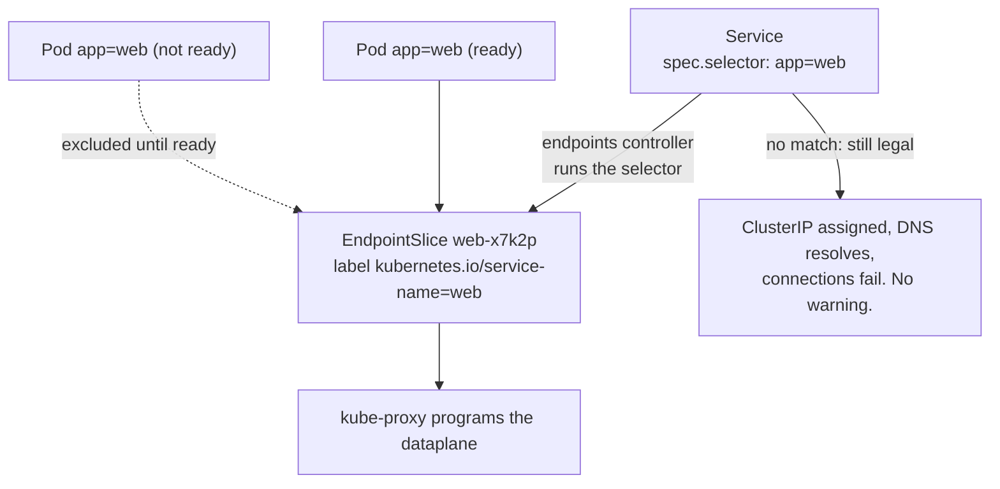

# Services

[Deployments](../deployments/) showed a controller acting on a label selector.
A Service is the same idea pointed at the network — and it is the place where
Kubernetes' habit of failing *silently* is most expensive. A Service whose
selector matches nothing is a completely legal object. It gets a ClusterIP, DNS
resolves it, and every connection to it fails. Nothing warns you.

So this topic is about not trusting the create. You write the selector, then
you go and read what the control plane produced from it: the EndpointSlices
that carry the actual pod IPs. Those slices are not named after the Service and
there is more than one of them, which means finding them takes a label query of
its own.

## 1. A selector nobody validates

```go
Selector: map[string]string{"app": "web"}, // must match the pods' labels
```

`Service.spec.selector` is a plain `map[string]string` — equality only, ANDed
across keys. There is no `matchExpressions` here; Services predate the richer
`LabelSelector` type and never got it.

The endpoints controller runs that selector against pods in the namespace and
writes the matching, **ready** pod IPs into EndpointSlices; kube-proxy programs
the dataplane from those slices. Get the selector wrong and the whole chain
produces nothing, quietly.



```ascii
  Service spec.selector: app=web
        │
        │  endpoints controller runs the selector over pods in the namespace
        v
  Pods app=web, READY ──> EndpointSlice web-x7k2p
                          label: kubernetes.io/service-name=web
                                  │
                                  v
                          kube-proxy programs the dataplane

  selector matches nothing?  Object is still valid.
  ClusterIP assigned, DNS resolves, connections fail. No warning.
```

`labels.Set(svc.Spec.Selector).String()` turns the map into the `"app=web"`
query form, which is how you re-run the Service's own selector as a `List` and
prove it selects something. Do that in your own code rather than trusting the
create — it is exactly what the exercise does.

Two adjacent facts: a Service with **no** selector at all is also legal and
deliberate — it means "I will manage the EndpointSlices myself", the standard
way to point a Service at an external address. And the selector matches *pods*,
not Deployments, which is the mechanism behind blue/green and canary routing:
two Deployments whose pods share a label are both behind the Service.

## 2. EndpointSlices are found by label, not by name

```go
slices, err := cs.DiscoveryV1().EndpointSlices(ns).List(ctx, metav1.ListOptions{
	LabelSelector: discoveryv1.LabelServiceName + "=web", // "kubernetes.io/service-name"
})
```

There is nothing to `Get`. The controller generates names like `web-x7k2p`, and
there can be several slices per Service: the control plane packs at most **100**
endpoints per slice by default (`--max-endpoints-per-slice`, raisable to 1000,
which is also the API's hard cap), and splits further by address type and port
set.

The link back to the Service is the label `kubernetes.io/service-name`,
exported as `discoveryv1.LabelServiceName`. Use the constant. A mistyped label
selector is not an error — it is an empty list, indistinguishable from "no
endpoints yet", and your wait loop will spin happily until it times out.

`ep.Conditions.Ready` is a `*bool` for the reason [deployments](../deployments/)
covered: `nil` means *unknown*, which is not `false`. Nil-check before
dereferencing. `Conditions` also carries `Serving` and `Terminating`, which
distinguish "still draining connections" from "gone" — the basis of graceful
shutdown.

## 3. The old Endpoints API

`v1.Endpoints` — one object named exactly after the Service — is **deprecated
as of Kubernetes 1.33**, and the API server now emits warnings when you read or
write it. It does not scale (every pod change rewrites one object that every
node is watching) and it cannot carry topology hints or dual-stack addresses.
New code reads `discovery.k8s.io/v1`.

Note this deprecation is *not* in the Deprecated API Migration Guide — that
page tracks removals, and Endpoints has not been removed. The `[deprecated]`
badge lives on the EndpointSlice concept page.

## Gotchas

- **A selector matching zero pods is a valid Service.** Assert that it selects
  something; nothing else will.
- **`spec.selector` on a Service is equality-only.** No `matchExpressions`, no
  set-based operators.
- **EndpointSlices are not named after the Service.** List and filter by
  `discoveryv1.LabelServiceName`; never construct the name.
- **One Service can have many slices.** Iterate; do not take `Items[0]`.
- **`Conditions.Ready` is `*bool`.** `nil` is "unknown", not "not ready".
- **Endpoints only appear once pods are ready.** A wait loop here is not
  optional.

## The exercises

- **svc1** — create a Service and then re-run its own selector as a `List` to
  prove it actually selects the pods you meant.
- **svc2** — find the Service's EndpointSlices by the well-known service-name
  label, and read readiness off a `*bool`.

## Source references

- [Services](https://kubernetes.io/docs/concepts/services-networking/service/)
  · [`ServiceSpec`](https://pkg.go.dev/k8s.io/api/core/v1#ServiceSpec)
- [EndpointSlices](https://kubernetes.io/docs/concepts/services-networking/endpoint-slices/)
  · [`discovery/v1` constants](https://pkg.go.dev/k8s.io/api/discovery/v1#pkg-constants)
- [`discovery/v1/types.go`](https://github.com/kubernetes/api/blob/master/discovery/v1/types.go)
  — `EndpointConditions` and why each field is a pointer
- [Endpoints deprecation, v1.33](https://kubernetes.io/blog/2025/04/24/endpoints-deprecation/)
- [`labels.Set`](https://pkg.go.dev/k8s.io/apimachinery/pkg/labels#Set)
