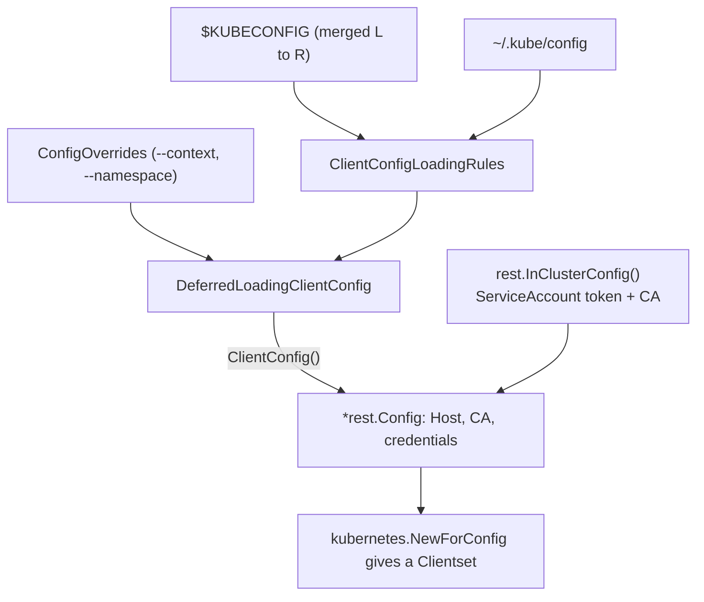

# Setup

Every client-go program — a one-off script, a `kubectl` plugin, a controller
that runs forever — begins the same way: find credentials, turn them into a
`*rest.Config`, and wrap that in a client. Nothing above this layer works until
this layer is right, and when it is wrong the failure almost never says so. An
empty config builds a perfectly valid clientset; you find out on the first
request, as a dial error against an empty URL.

The chain is three links: **loading rules** decide which files to read,
`*rest.Config` is the credential bundle they collapse into, and
`kubernetes.NewForConfig` turns that bundle into typed clients that share one
HTTP transport. This chapter follows the chain, then tunes it for a process
that has to survive contact with a real cluster.

## 1. Loading rules: kubectl's search order, as a library

```go
rules := clientcmd.NewDefaultClientConfigLoadingRules()
overrides := &clientcmd.ConfigOverrides{CurrentContext: "kind-kubeclientlings"}
config, err := clientcmd.NewNonInteractiveDeferredLoadingClientConfig(rules, overrides).ClientConfig()
```

`NewDefaultClientConfigLoadingRules()` is not a file path — it is kubectl's own
search order expressed as data: `$KUBECONFIG` first (colon-separated, merged
left to right, earlier files winning), then `~/.kube/config`. `ConfigOverrides`
is the in-process form of kubectl's flags, so setting `CurrentContext` is
literally `kubectl --context=…`.

Nothing is read until `ClientConfig()` — that is what *deferred* means in
`NewNonInteractiveDeferredLoadingClientConfig`. *Non-interactive* means it will
never stop and prompt a terminal for a missing auth field; it returns an error
instead, which is the only sane behaviour inside a controller.



```ascii
  $KUBECONFIG ─┐
               ├─> LoadingRules ─┐
  ~/.kube/config ─┘              ├─> DeferredLoadingClientConfig
                 ConfigOverrides ┘            │
                                              │ ClientConfig()
                                              v
  rest.InClusterConfig() ─────────────>  *rest.Config
  (ServiceAccount token + CA)            Host / CA / creds
                                              │
                                              v
                                  kubernetes.NewForConfig()
                                              │
                                              v
                                          Clientset
```

Two shortcuts you will meet in older examples are *not* equivalent:
`clientcmd.BuildConfigFromFlags("", path)` takes one explicit path and ignores
`$KUBECONFIG` entirely — reach for it only when a user literally passed
`--kubeconfig`. Inside a pod you want `rest.InClusterConfig()`, which reads the
projected ServiceAccount token and CA from
`/var/run/secrets/kubernetes.io/serviceaccount`.

## 2. `*rest.Config` is the whole credential bundle

Whatever produced it, `*rest.Config` carries the same things: the API server
address (`Host`), the CA bundle that verifies it, and one of the credential
forms — client certificate, bearer token, or an exec plugin that mints one on
demand. Every client-go constructor from here on takes this and nothing else.

`config.Host == ""` is the tell-tale of a config that "loaded" but resolved to
nothing. It is worth asserting on at startup, because otherwise it surfaces
much later and much less legibly.

## 3. One clientset, shared everywhere

```go
clientset, err := kubernetes.NewForConfig(config)
```

`NewForConfig` copies the config, applies defaults (content type, negotiated
serializer, rate limiter) and builds one typed client per group/version.
`clientset.CoreV1()`, `AppsV1()`, `BatchV1()` are accessors on that one struct,
sharing the underlying transport and its connection pool. Build the clientset
**once** at startup and pass it around; constructing one per request throws
away connection reuse and gives each copy its own rate-limit bucket.

The method signatures encode scope. `Nodes()` takes no namespace because Node
is cluster-scoped; `Pods(ns)` takes one because Pod is not. That distinction is
the whole subject of the first exercise in [pods](../pods/).

## 4. Tuning for a process that runs forever

```go
config.QPS = 50
config.Burst = 100
config.Timeout = 10 * time.Second
config.UserAgent = "kubeclientlings/setup3"
```

`QPS` and `Burst` drive a **client-side** token-bucket limiter sitting in front
of the transport. The defaults — 5 QPS, 10 burst — are fine for a CLI making a
handful of calls and disastrous for a controller: once the bucket empties,
client-go *silently blocks before the request is sent*. The symptom is
multi-second latency against a completely idle API server, which sends people
hunting in the wrong place entirely. Keep `Burst >= QPS`, or a burst is
throttled the instant it begins.

Modern clusters do server-side fair queueing through **API Priority and
Fairness**, which is why upstream now recommends raising client QPS well above
the old defaults and letting the server arbitrate.

`Timeout` is applied to the underlying `http.Client`, so it bounds the entire
request — including a watch, which is why a watch or informer client needs its
own config without it. `UserAgent` is sent on every request and lands in the
API server's audit log and metrics; it is how a cluster operator works out
which client is hammering them.

All of these must be set **before** `NewForConfig`. The constructor copies the
config, so mutating it afterwards changes nothing.

## Gotchas

- **`&rest.Config{}` compiles and builds a working-looking clientset.** An
  empty config means "no host, no credentials", so the failure lands on the
  first request, far from the cause.
- **Never `clientset, _ := …`.** Constructors error for real reasons — bad TLS
  material, an unparseable host, a broken exec-credential plugin — and
  discarding that turns a clean startup failure into a misbehaving client.
- **`Timeout` on a watch client tears the stream down on schedule.** Use
  `context` deadlines for individual calls instead.
- **Config mutations after `NewForConfig` are ignored.** The clientset holds a
  copy.
- **`BuildConfigFromFlags("", "")` silently falls back to in-cluster config.**
  Convenient in a pod, confusing on a laptop.

## The exercises

- **setup1** — build a `*rest.Config` the way kubectl does, pinning the context
  with `ConfigOverrides` so the exercise reaches the kind cluster whatever your
  shell is pointed at.
- **setup2** — turn that config into a clientset and list Nodes, meeting both
  classic bugs: the empty `&rest.Config{}` and the swallowed error.
- **setup3** — set `QPS`, `Burst`, `Timeout` and `UserAgent`, and understand
  which of them a long-running client must *not* have.

## Source references

- [`clientcmd`](https://pkg.go.dev/k8s.io/client-go/tools/clientcmd) —
  `ClientConfigLoadingRules`, `ConfigOverrides`, the deferred loader
- [`rest.Config`](https://pkg.go.dev/k8s.io/client-go/rest#Config) — every
  field the rest of client-go reads
- [`kubernetes.NewForConfig`](https://pkg.go.dev/k8s.io/client-go/kubernetes#NewForConfig)
  and the [Clientset](https://pkg.go.dev/k8s.io/client-go/kubernetes#Clientset)
- [`client-go/rest/config.go`](https://github.com/kubernetes/client-go/blob/master/rest/config.go)
  — where `QPS`, `Burst` and `Timeout` are actually applied
- [Organizing cluster access with kubeconfig](https://kubernetes.io/docs/concepts/configuration/organize-cluster-access-kubeconfig/)
  — the merge rules, from the source of truth
- [API Priority and Fairness](https://kubernetes.io/docs/concepts/cluster-administration/flow-control/)
- [Accessing the API from a Pod](https://kubernetes.io/docs/tasks/administer-cluster/access-cluster-api/)
