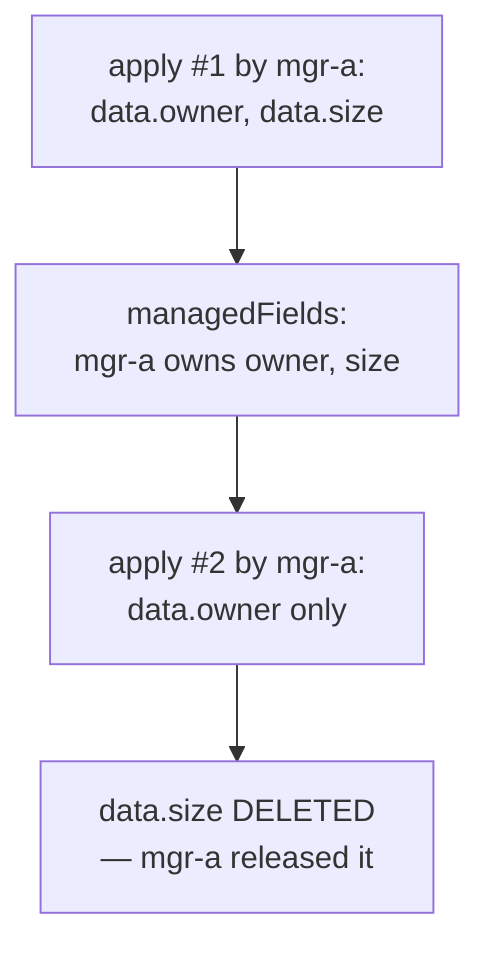
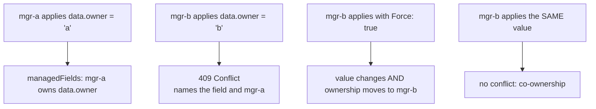

# Server-Side Apply

Every write so far has been imperative in shape: read the object, mutate it,
send it back, and hope nobody else was writing at the same time. That works
until two controllers care about one object — and then it fails the worst way
Kubernetes fails, which is silently. Each overwrites the other every few
seconds, and the only symptom is a resource that flaps.

Server-Side Apply reverses the flow. You send **only the fields you intend to
own**, the API server merges them into whatever is there, and it records in
`metadata.managedFields` which manager set which field. That ledger is the
whole feature. It makes multi-writer objects safe, it turns a silent fight into
a 409 that names your opponent, and it is the one merge mechanism that works on
CRDs — because it reads list-merge semantics from the OpenAPI schema rather
than from Go struct tags.

## 1. A declaration needs an author

```go
apply := applyconfigcorev1.ConfigMap("settings", ns).
	WithData(map[string]string{"replicas": "3"})

_, err := cs.CoreV1().ConfigMaps(ns).Apply(ctx, apply, metav1.ApplyOptions{
	FieldManager: "kubeclientlings",
})
```

One HTTP call. No `Get` first, no `resourceVersion`, no 409 retry loop — the
whole read-modify-write cycle from [pods](../pods/) disappears.

Without a `FieldManager` there is nothing to record ownership under, so the
server rejects the request rather than guessing. The **apply-configuration
builders** produce structs where every field is a pointer, so unset and zero are
distinguishable — required precision, because a plain `corev1.ConfigMap` full of
Go zero values would read as a claim over every field in the type.

Apply also **removes**. If your manager set a field last time and your next
apply omits it, the server sees the release and deletes the value.



```ascii
  apply #1 (mgr-a): {owner, size}   -> mgr-a owns owner + size
  apply #2 (mgr-a): {owner}         -> size is DELETED

  An apply is a full declaration of what you own, never a partial diff.
  Send half your config and you just deleted the other half.
```

The corollary is a **stable** manager name. One derived from a pod name, a UUID
or a timestamp creates a new owner on every restart, leaving the old name's
fields orphaned in `managedFields` forever.

## 2. Conflicts are the feature

```go
// mgr-a owns data.owner
cs.CoreV1().ConfigMaps(ns).Apply(ctx, applyA, metav1.ApplyOptions{FieldManager: "mgr-a"})

// mgr-b takes it, knowingly
cs.CoreV1().ConfigMaps(ns).Apply(ctx, applyB, metav1.ApplyOptions{FieldManager: "mgr-b", Force: true})
```

When `mgr-b` applies a **different value** to a field `mgr-a` owns, the server
returns `409 Conflict` with a body listing exactly which fields are contested
and who holds them. That refusal is the point: under `Update` or `Patch` the
same situation is a silent overwrite war.



```ascii
  mgr-a: data.owner = "a"     -> mgr-a owns data.owner
  mgr-b: data.owner = "b"     -> 409 Conflict (names the field and mgr-a)
  mgr-b: data.owner = "b" + Force  -> value changes, ownership MOVES to mgr-b
  mgr-b: data.owner = "a"     -> no conflict; both co-own it

  Conflicts are about disagreement, not about touching.
```

When to force:

- **Controllers should force.** A controller is the authority over the fields
  it manages; on conflict it should reassert them, or it wedges on the first
  human `kubectl edit`. `kubectl apply --server-side --force-conflicts` is the
  same escape hatch for people.
- **Interactive tools should not.** The conflict error names the other manager,
  which is exactly the information a human needs before clobbering something a
  controller maintains.

To *release* a field rather than steal it, stop including it — ownership
disappears with the value. Note that abandoning a manager name entirely
(renaming your controller) does **not** clean up: those fields stay owned by a
name nobody will use again.

## 3. Why apply is the answer for CRDs

Strategic merge patch reads `patchStrategy` and `patchMergeKey` struct tags off
the built-in Go types, which is why it does not work on custom resources — see
[deployments](../deployments/). Apply gets the same information from the CRD's
structural OpenAPI schema (`x-kubernetes-list-type`,
`x-kubernetes-list-map-keys`), so lists merge correctly on types nobody
generated Go structs for. That, plus the ownership ledger, is why apply is the
modern default for controllers writing custom resources.

## Gotchas

- **`FieldManager` is mandatory**, and it must be stable across restarts.
- **An apply is a complete declaration, not a diff.** Omitting a field you own
  deletes it.
- **Use the apply-configuration builders, not the plain types.** Zero values in
  a plain struct read as ownership claims.
- **A 409 from apply is information, not a failure to swallow.** It names the
  field and the manager.
- **`Force` moves ownership, it does not share it.** The previous owner will
  now conflict.
- **Applying an identical value is co-ownership, not a conflict.**
- **A renamed manager orphans its old fields forever.**

## The exercises

- **ssa1** — apply a ConfigMap through the generated apply configurations with
  a field manager, and see ownership recorded.
- **ssa2** — provoke a conflict between two managers, then take the field
  deliberately with `Force`.

## Source references

- [Server-Side Apply](https://kubernetes.io/docs/reference/using-api/server-side-apply/)
  · [Field management](https://kubernetes.io/docs/reference/using-api/server-side-apply/#field-management)
  · [Conflicts](https://kubernetes.io/docs/reference/using-api/server-side-apply/#conflicts)
- [`client-go/applyconfigurations`](https://pkg.go.dev/k8s.io/client-go/applyconfigurations)
  — the pointer-per-field builders
- [`metav1.ApplyOptions`](https://pkg.go.dev/k8s.io/apimachinery/pkg/apis/meta/v1#ApplyOptions)
  · [`metav1.ManagedFieldsEntry`](https://pkg.go.dev/k8s.io/apimachinery/pkg/apis/meta/v1#ManagedFieldsEntry)
- [`kubernetes-sigs/structured-merge-diff`](https://github.com/kubernetes-sigs/structured-merge-diff)
  — the merge algorithm itself
- [KEP-555: Server-Side Apply](https://github.com/kubernetes/enhancements/tree/master/keps/sig-api-machinery/555-server-side-apply)
  — the design rationale
