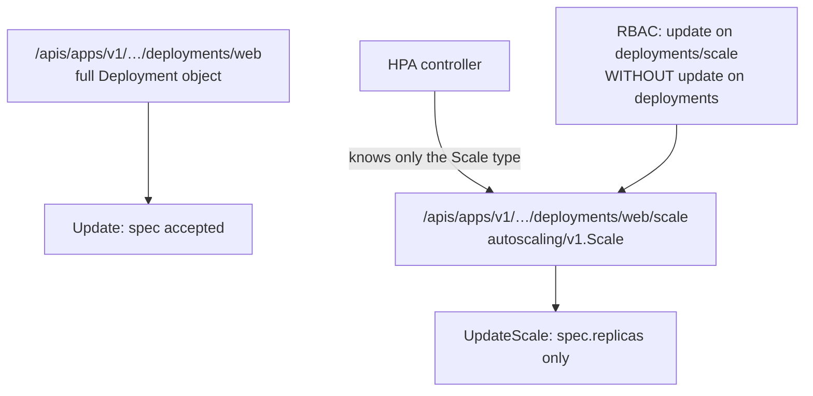
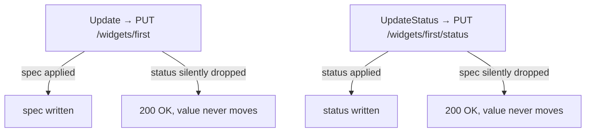

# Subresources

An object looks like one document, and for writing purposes it often is not.
Some fields live behind their own URL, with their own type and their own RBAC
verb — and once a field lives there, the *main* endpoint stops accepting writes
to it. Not with an error: it takes your request, returns 200, and silently
drops that half of the object.

That silence is the entire hazard of this topic. It is also, once you see why,
the mechanism that makes controllers work at all: it is what keeps a user
editing `spec` and a controller writing `status` from clobbering each other,
and what makes `metadata.generation` mean something.

## 1. `/scale` is a different endpoint with a different type

```go
scale, err := cs.AppsV1().Deployments(ns).GetScale(ctx, "web", metav1.GetOptions{})
scale.Spec.Replicas = 3 // DESIRED count — Status.Replicas is observed, read-only
_, err = cs.AppsV1().Deployments(ns).UpdateScale(ctx, "web", scale, metav1.UpdateOptions{})
```

`.../deployments/web/scale` exposes `autoscaling/v1.Scale` — a tiny uniform
view with just `spec.replicas`, `status.replicas` and `status.selector`.
`Spec.Replicas` is desired, `Status.Replicas` is observed, and the server
ignores status on write, so setting it changes nothing and the Deployment stays
at 1.



```ascii
  .../deployments/web         full object      Update       (spec)
  .../deployments/web/scale   autoscaling/v1.Scale  UpdateScale  (spec.replicas)
                              │
                              ├── same Scale type for Deployment, StatefulSet,
                              │   ReplicaSet, and any CRD with subresources.scale
                              └── RBAC: update deployments/scale, and nothing else
```

Uniformity is the payoff: one HPA controller scales resources it has no
compile-time knowledge of, and `kubectl scale` works on your CRD. RBAC is
per-subresource, so you can grant `update` on `deployments/scale` without
`update` on `deployments` — the holder resizes but cannot touch the image or
the selector, a permission impossible to express with a whole-object Update.

The other reason to use `/scale`: writing `spec.replicas` through a full
`Update` sends the entire object, so it can clobber a concurrent change to an
unrelated field. `UpdateScale` touches one number.

Beware the HPA interaction: if an HPA manages a Deployment, anything you write
to `spec.replicas` through either path is transient — the HPA moves it back on
its next tick.

## 2. Status is a separate write path

```go
// on the CRD:
Subresources: &apiextensionsv1.CustomResourceSubresources{
	Status: &apiextensionsv1.CustomResourceSubresourceStatus{},
},

// in the client:
unstructured.SetNestedField(got.Object, "Ready", "status", "phase")
_, err = dyn.Resource(gvr).Namespace(ns).UpdateStatus(ctx, got, metav1.UpdateOptions{})
```

Declaring `subresources.status` splits one object into two write paths, and
each endpoint then **ignores** the other's half:



```ascii
  PUT /widgets/first          spec  -> applied      status -> DROPPED (200 OK)
  PUT /widgets/first/status   spec  -> DROPPED      status -> applied  (200 OK)

  No error either way. The write succeeds and the field simply does not move.
```

The split exists so a user editing `spec` and a controller writing `status`
cannot clobber each other. Each sends a whole object; each has half discarded.
Without the subresource, a controller's status write would also carry — and
overwrite — whatever `spec` it last read.

With the status subresource enabled, `metadata.generation` also starts
behaving: it increments **only** on spec changes, never on status writes. That
is what makes the `generation` vs `observedGeneration` comparison from
[deployments](../deployments/) meaningful — without it, a controller writing
status would bump the generation and race itself forever.

RBAC splits here too: `update` on `widgets/status` without `update` on
`widgets` is exactly the permission set a controller should hold.

For built-ins the same pattern is
`cs.AppsV1().Deployments(ns).UpdateStatus(...)`, and status is enabled on
essentially everything. The modern shape is:

```go
obj.Status.Phase = "Ready"
meta.SetStatusCondition(&obj.Status.Conditions, metav1.Condition{ /* … */ })
_, err := client.UpdateStatus(ctx, obj, metav1.UpdateOptions{})
```

Status writes obey the same optimistic-concurrency rules as any Update, so wrap
them in `retry.RetryOnConflict` — status is the field most likely to be
contended.

## Gotchas

- **Writing `status` through the main endpoint returns 200 and does nothing.**
  Symmetrically for `spec` through `/status`.
- **`Scale.Status.Replicas` is read-only.** Set `Spec.Replicas`.
- **`generation` only behaves once the status subresource exists.** Otherwise
  status writes bump it.
- **A subresource is its own RBAC verb.** Granting the parent does not grant
  it, and vice versa.
- **`UpdateStatus` still needs conflict retry.** It is an ordinary optimistic
  write.
- **An HPA will undo your replica writes.** Both paths.

## The exercises

- **sub1** — scale a Deployment through `/scale`, setting the desired count
  rather than the observed one.
- **sub2** — enable the status subresource on a CRD and discover which endpoint
  actually moves `status`.

## Source references

- [`autoscaling/v1.Scale`](https://pkg.go.dev/k8s.io/api/autoscaling/v1#Scale)
  · [`DeploymentInterface.UpdateScale`](https://pkg.go.dev/k8s.io/client-go/kubernetes/typed/apps/v1#DeploymentInterface)
- [CRD status subresource](https://kubernetes.io/docs/tasks/extend-kubernetes/custom-resources/custom-resource-definitions/#status-subresource)
  · [scale subresource](https://kubernetes.io/docs/tasks/extend-kubernetes/custom-resources/custom-resource-definitions/#scale-subresource)
- [Object spec and status](https://kubernetes.io/docs/concepts/overview/working-with-objects/kubernetes-objects/#object-spec-and-status)
- [`meta.SetStatusCondition`](https://pkg.go.dev/k8s.io/apimachinery/pkg/api/meta#SetStatusCondition)
  · [`metav1.Condition`](https://pkg.go.dev/k8s.io/apimachinery/pkg/apis/meta/v1#Condition)
- [RBAC on subresources](https://kubernetes.io/docs/reference/access-authn-authz/rbac/#referring-to-resources)
