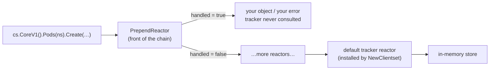

# Testing

A controller's interesting behaviour is almost entirely about failure: the
conflict retry, the `IsNotFound` branch, the backoff when the API server is
unhappy. None of that is reachable against a healthy cluster, and all of it is
where the bugs are. The fake clientset exists to make those paths ordinary unit
tests — fast, deterministic, and runnable anywhere `go` runs.

Three pieces make that work. The **fake clientset** implements the same
interface as the real one, over an in-memory object tracker. **Reactors** let
you intercept any call and return whatever error you like. And **`Actions()`**
records every call the fake received, turning "what did my controller actually
do?" into an assertion.

The important caveat runs through all of it: the fake is a good imitation, not
an API server. Knowing precisely where the imitation stops is what keeps these
tests from giving false confidence.

## 1. The fake clientset and its tracker

```go
cs := fake.NewClientset(
	&corev1.Pod{ObjectMeta: metav1.ObjectMeta{Name: "seeded", Namespace: "demo"}},
)

got, err := cs.CoreV1().Pods("demo").Get(ctx, "seeded", metav1.GetOptions{})
```

`fake.Clientset` implements `kubernetes.Interface` — the *same* interface the
real clientset implements. So any function that takes `kubernetes.Interface`
rather than `*kubernetes.Clientset` is testable with no cluster, no network and
no flakes. That is the practical reason to accept the interface in your own
signatures.

Behind it sits an `ObjectTracker`: an in-memory store keyed by **GVR +
namespace + name**, with real semantics — Create on an existing name returns
`AlreadyExists`, Get on a missing one returns `NotFound`, and namespace is part
of the key, so seeding into `demo` and querying `default` is an ordinary
`NotFound`.

Where the imitation stops:

| Real cluster | Fake |
|---|---|
| validation, defaulting, admission | **none** — an empty Pod spec is accepted |
| controllers | **none** — a Deployment creates no ReplicaSet, GC never runs |
| `ownerReferences` | inert strings |
| `resourceVersion` | not maintained faithfully — optimistic concurrency is not reproduced |
| deep-copy on write | objects you seed are **not** copied in |

For anything depending on real API-server behaviour, use `envtest`, which runs
an actual `kube-apiserver` and `etcd` binary. The fake is for unit tests of
*your* logic; envtest is for integration tests of the interaction.

On the two constructors: `NewSimpleClientset` is not deprecated, but
`NewClientset` is the one to reach for — its doc comment says why:

> Compared to NewSimpleClientset, the Clientset returned here supports field
> tracking and thus server-side apply.

So code under test that uses `Apply` (see [ssa](../ssa/)) needs
`NewClientset`. That same comment warns SSA support for **CRDs** is still
missing, so an apply against a custom resource is not faithfully faked by
either.

## 2. Reactors: testing the sad path

```go
cs.PrependReactor("create", "pods", func(action k8stesting.Action) (bool, runtime.Object, error) {
	return true, nil, apierrors.NewInternalError(fmt.Errorf("etcd unavailable"))
})
```

Every call walks a chain of reactors before reaching the tracker:



```ascii
  call ─> [ PrependReactor ] ─> [ … ] ─> [ default tracker reactor ] ─> store
             │                                    ^
             └── handled=true: answer here,       └── AddReactor appends HERE,
                 tracker never runs                   i.e. after the tracker
                                                      already answered
```

Registration is `(verb, resource)` and it must match the call you want.
`"update"` does not fire on a Create — the reactor is simply never invoked, the
tracker handles the create normally, and `err` is `nil`. Nothing warns you that
your reactor was dead code. Both arguments take `"*"` as a wildcard.

Use the real constructors (`apierrors.NewInternalError`, `NewConflict`,
`NewNotFound`) rather than `errors.New`, so the `apierrors.Is*` checks in the
code under test actually match. The `Action` argument carries the details, so a
reactor can be selective:

```go
cs.PrependReactor("create", "pods", func(action k8stesting.Action) (bool, runtime.Object, error) {
	pod := action.(k8stesting.CreateAction).GetObject().(*corev1.Pod)
	if pod.Name != "doomed" {
		return false, nil, nil // not ours — fall through to the tracker
	}
	return true, nil, apierrors.NewInternalError(fmt.Errorf("etcd unavailable"))
})
```

Closing over a counter is the standard way to fail the first N attempts and
then succeed — exactly what a retry test needs.

## 3. `Actions()` is your audit log

```go
actions := cs.Actions()
actions[0].Matches("create", "configmaps") // (verb, resource) — the call you made

create := actions[0].(k8stesting.CreateAction)
obj := create.GetObject().(*corev1.ConfigMap)
```

The fake appends an `Action` for **every** call, in order. `Matches(verb,
resource)` compares the recorded verb (`get`, `list`, `watch`, `create`,
`update`, `patch`, `delete`, `delete-collection`) and the plural resource name.

`Action` is an interface; the concrete types carry the payload —
`CreateAction`/`UpdateAction` have `GetObject()`, `PatchAction` has
`GetPatch()` and `GetPatchType()`, `GetAction`/`DeleteAction` have `GetName()`,
and all of them have `GetNamespace()` and `GetSubresource()`.

Assert on the payload. "It didn't error" is a weak test; "it created a
ConfigMap named `audited` in `demo` with `data.k=v`" catches regressions.

`Actions()` records **reads too**, which trips people up: a test asserting
`len(actions) == 1` after a reconcile that did one Get and one Create fails,
and the count stays fragile as the code evolves. Filter instead of counting:

```go
for _, a := range cs.Actions() {
	if a.Matches("create", "configmaps") { /* … */ }
}
```

`cs.ClearActions()` resets the log between phases of a table test. And for
**subresource** writes the verb alone is ambiguous: an `UpdateStatus` records
as `update` with `GetSubresource() == "status"`. If your controller writes both
spec and status, that field is how you tell them apart — see
[subresources](../subresources/).

## Gotchas

- **The fake does no validation, defaulting or admission.** Objects a real
  cluster would reject sail through.
- **No controllers run.** No ReplicaSets, no garbage collection,
  `ownerReferences` are inert.
- **`resourceVersion` is not faithful.** Do not test conflict semantics against
  it — inject the conflict with a reactor instead.
- **Seeded objects are not deep-copied in.** Mutating your struct mutates the
  tracker.
- **A reactor whose `(verb, resource)` does not match is silently dead code.**
- **`AddReactor` appends after the tracker.** Use `PrependReactor`.
- **Use `apierrors` constructors, not `errors.New`.** Otherwise `Is*` checks
  miss.
- **`Actions()` includes reads.** Filter, never count.
- **`Apply` needs `NewClientset`**, and is still unfaithful for CRDs.

## The exercises

- **test1** — seed a fake clientset and read back through the same interface
  the real client implements.
- **test2** — inject an API failure with a reactor and exercise the error path.
- **test3** — assert on `Actions()` that the right write actually happened,
  with the right payload.

## Source references

- [`kubernetes/fake`](https://pkg.go.dev/k8s.io/client-go/kubernetes/fake) ·
  [`client-go/testing`](https://pkg.go.dev/k8s.io/client-go/testing)
- [`testing/fixture.go`](https://github.com/kubernetes/client-go/blob/master/testing/fixture.go)
  — the `ObjectTracker` and the default reactor
- [`testing/actions.go`](https://github.com/kubernetes/client-go/blob/master/testing/actions.go)
  — every `Action` type and what it carries
- [`apierrors` constructors](https://pkg.go.dev/k8s.io/apimachinery/pkg/api/errors)
- [sample-controller tests](https://github.com/kubernetes/sample-controller/blob/master/controller_test.go)
  — the fake used the way upstream uses it
- [envtest](https://book.kubebuilder.io/reference/envtest.html) — when the fake
  is not enough
