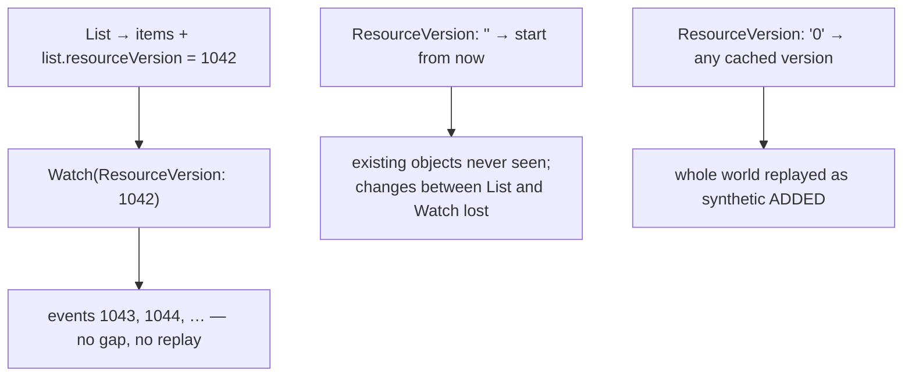
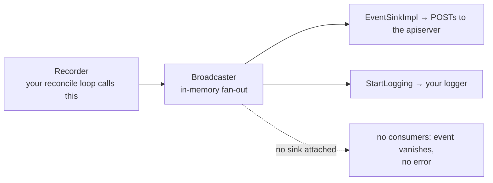

# Watch

Everything so far has been a request and a reply. Watch is the other shape:
a long-lived stream of changes, and the primitive under every controller in
Kubernetes. It is also where the API stops being forgiving. A watch is
*expected* to end — the API server kills each one on a timer by design — and
starting it at the wrong point in history silently gives you either duplicates
or a hole.

The correct pattern has a name, **list-then-watch**, and it exists because a
`List` response tells you the exact point in history it represents. Get that
handoff right and you have a coherent view of the cluster; get it wrong and you
have a controller acting on a world that never existed. This chapter builds the
pattern up, then layers on reconnection, then ends with how a controller tells
humans what it did.

## 1. The stream, and the two events that are not object changes

```go
switch event.Type {
case watch.Added:
	sawAdded = true
case watch.Deleted:
	sawDeleted = true
}
```

`Watch` opens a long-lived chunked HTTP response and returns a
`watch.Interface`. `ResultChan()` yields `watch.Event{Type, Object}` until the
stream ends; `Stop()` closes it — always `defer` that, or you leak a connection
and a goroutine.

`watch.EventType` is a **defined string type**, so `case "DELETE"` compiles
without complaint and simply never matches. The constants are `watch.Added`,
`watch.Modified`, `watch.Deleted`, `watch.Bookmark`, `watch.Error` (underlying
`"ADDED"`, `"MODIFIED"`, `"DELETED"`, `"BOOKMARK"`, `"ERROR"`). Use them and
the compiler catches typos.

`event.Object` is a `runtime.Object` and needs a type assertion — always the
two-value form, because on a `watch.Error` the object is a `*metav1.Status` and
a single-value assertion panics.

Those last two types matter. `watch.Error` most often carries "resourceVersion
too old" (HTTP 410 Gone): the server's history window has passed you by and you
must re-List. `watch.Bookmark` carries no useful object but does carry an
updated `resourceVersion`, letting a client checkpoint its position on a quiet
watch so it can resume without a full relist.

## 2. list-then-watch: no gap, no replay

```go
list, err := cs.CoreV1().Pods(ns).List(ctx, metav1.ListOptions{})
// ...
watcher, err := cs.CoreV1().Pods(ns).Watch(ctx, metav1.ListOptions{
	ResourceVersion: list.ResourceVersion, // resume exactly where the list ended
})
```

Every `List` response carries a `metadata.resourceVersion` on the **list
itself**: the point in the API server's history that snapshot represents.
Starting a watch there means you see every change after the snapshot and none
of the ones already in it.



```ascii
  List  ─────────────> items + list.resourceVersion = 1042
                                 │
  Watch(ResourceVersion: 1042) ──┘ ─> 1043, 1044, …   no gap, no replay

  ResourceVersion: ""   start from NOW      existing objects never seen,
                                            changes between List and Watch lost
  ResourceVersion: "0"  any cached version  whole world replayed as ADDED
  ResourceVersion: N    resume exactly at N the only correct handoff
```

resourceVersions are **opaque**. They are strings that happen to look like
integers today; never parse, compare or increment them. The only valid
operations are passing one back to the server and comparing for equality.

A concrete version can also go stale. The API server keeps a bounded sliding
window of recent events per resource — the **watch cache** — and a client slow
or disconnected long enough for that window to move past its resourceVersion
gets a `410 Gone` as a `watch.Error`. Do not code against a window size: it is
capacity-bounded as well as time-bounded, varies by resource and cluster load,
and the default has changed across releases. Code against the **error**: on
410, List again and restart from the new version.

## 3. Reconnection is not optional

```go
watcher, err := watchtools.NewRetryWatcherWithContext(ctx, list.ResourceVersion, &cache.ListWatch{
	WatchFuncWithContext: func(ctx context.Context, options metav1.ListOptions) (watch.Interface, error) {
		return cs.CoreV1().Pods(ns).Watch(ctx, options)
	},
})
```

The API server computes each watch's lifetime as
`minRequestTimeout * (rand.Float64() + 1.0)` — a random value between 1× and 2×
the `--min-request-timeout` flag. The randomisation is deliberate, so a
thousand clients that connected together do not all reconnect together. Load
balancers cutting long connections and ordinary network blips do the rest.
Every one of those closes `ResultChan()`, and naive code reads the closed
channel and exits.

`RetryWatcher` reconnects, passing the resourceVersion of the **last event it
delivered**, so your consumer sees one uninterrupted channel. It takes a
`cache.ListWatch` because it needs to *re-invoke* the watch rather than consume
one — and `WatchFuncWithContext` specifically, the variant that lets `ctx`
cancellation reach the retry loop.

It rejects `""` and `"0"` at construction. That refusal is deliberate: neither
identifies a point in history, so after a reconnect the watcher could not
promise it had neither skipped nor replayed. Forcing a real resourceVersion
forces you into list-then-watch.

What it does **not** do is recover from a `410 Gone` — the version it holds is
invalid and no retry helps. Recovering means Listing again and building a new
watcher, which is precisely what a `Reflector` does inside every informer. That
is the honest reason "use an informer" is the standard advice for anything
long-lived: see [informers](../informers/).

## 4. Telling humans what happened

```go
broadcaster := record.NewBroadcaster()
broadcaster.StartRecordingToSink(&typedcorev1.EventSinkImpl{
	Interface: cs.CoreV1().Events(ns),
})
defer broadcaster.Shutdown()

recorder := broadcaster.NewRecorder(scheme.Scheme, corev1.EventSource{Component: "kubeclientlings"})
recorder.Event(pod, corev1.EventTypeNormal, "Exercised", "kubeclientlings was here")
```

Three pieces, and the middle one is the one people forget:



```ascii
   recorder.Event(obj, type, reason, msg)
            │
            v
      Broadcaster  (in-memory fan-out)
            ├──> EventSinkImpl  -> POST to the apiserver
            ├──> StartLogging   -> your logger
            └──> (no sink attached) -> event vanishes, no error
```

Without a sink the broadcaster has no consumers, so `recorder.Event` succeeds
and nothing is on the other end. The recorder needs a `*runtime.Scheme` to
resolve the involved object's GroupVersionKind, and an `EventSource` naming the
component — that is the `From` column in `kubectl get events`.

In `recorder.Event(object, eventtype, reason, message)`: `eventtype` is
`EventTypeNormal` or `EventTypeWarning`; `reason` is a short CamelCase
machine-readable token (`Scheduled`, `FailedMount`) that people alert on, so
keep it stable; `message` is the human sentence.

Emission is **asynchronous** — the broadcaster's goroutine does the POST, which
is why you poll for the event to appear and why `defer broadcaster.Shutdown()`
matters: exiting without it drops whatever is in flight. The recorder also
**aggregates**: identical events dedupe into one object with a rising `count`
and rate-limit per object, which is what stops a hot reconcile loop writing
millions of events. "I only see one event" is usually correct behaviour.

Events carry a TTL (one hour by default). They are a debugging aid, not an
audit log; never build logic that reads them back.

## Gotchas

- **`case "DELETED":` compiles and never matches.** `watch.EventType` is a
  defined string type — use the constants.
- **Always assert `event.Object` with the two-value form.** A `watch.Error`
  carries `*metav1.Status`.
- **`ResourceVersion: "0"` replays the whole world as `Added`.** Sometimes what
  you want; never the same as resuming.
- **Never parse or compare resourceVersions.** Opaque, by contract.
- **A watch ending is normal, not an error.** Handle the closed channel or your
  controller quietly stops working after a few minutes.
- **`RetryWatcher` does not survive `410 Gone`.** Re-List and rebuild.
- **A recorder with no sink emits nothing and reports nothing.**
- **`recorder.Event` is asynchronous.** Shut the broadcaster down or lose
  in-flight events.

## The exercises

- **watch1** — consume a raw watch and switch on the real event-type constants.
- **watch2** — hand off from `List` to `Watch` at the list's resourceVersion.
- **watch3** — wrap a watch in `RetryWatcher` so a dropped connection is
  invisible to the consumer.
- **watch4** — emit an Event through a broadcaster with an actual sink
  attached.

## Source references

- [`apimachinery/pkg/watch`](https://pkg.go.dev/k8s.io/apimachinery/pkg/watch)
  — `Interface`, `Event`, the event-type constants
- [Efficient detection of changes](https://kubernetes.io/docs/reference/using-api/api-concepts/#efficient-detection-of-changes)
  · [Watch bookmarks](https://kubernetes.io/docs/reference/using-api/api-concepts/#watch-bookmarks)
  · [Resource versions](https://kubernetes.io/docs/reference/using-api/api-concepts/#resource-versions)
- [`watchtools.NewRetryWatcher`](https://pkg.go.dev/k8s.io/client-go/tools/watch#NewRetryWatcher)
  and [`tools/watch/retrywatcher.go`](https://github.com/kubernetes/client-go/blob/master/tools/watch/retrywatcher.go)
- [`cache.Reflector`](https://pkg.go.dev/k8s.io/client-go/tools/cache#Reflector)
  — list-then-watch plus 410 recovery, implemented
- [`tools/record`](https://pkg.go.dev/k8s.io/client-go/tools/record) ·
  [`corev1.Event`](https://pkg.go.dev/k8s.io/api/core/v1#Event)
