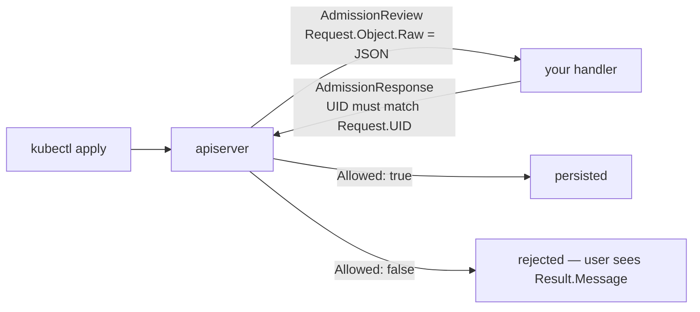

# Webhooks

Admission control looks like the most intimidating extension point in
Kubernetes — TLS certificates, CA bundles, a `ValidatingWebhookConfiguration`
nobody enjoys writing. But the part you actually write is one pure function:
`AdmissionReview` in, `AdmissionResponse` out. No cluster, no state, fully unit
testable, which is exactly how these exercises treat it.

The function is easy. What is not easy is that both of its failure modes are
quiet in opposite directions. A validating handler that forgets to set
`Allowed` denies everything, because `false` is the zero value. A mutating
handler that forgets `PatchType` mutates nothing, because a nil pointer means
"no patch here" and the server drops your work without a word. And around the
function, `failurePolicy: Fail` means a crashed webhook can stop a cluster from
scheduling pods at all.

## 1. Validating: echo the UID, set `Allowed` explicitly

```go
resp := &admissionv1.AdmissionResponse{UID: review.Request.UID} // echo the UID

if _, ok := pod.Labels["team"]; !ok { // deny when the label is ABSENT
	resp.Allowed = false
	resp.Result = &metav1.Status{Message: "pods must carry a team label"}
	return resp
}

resp.Allowed = true // must be explicit — the zero value is false
return resp
```



```ascii
  kubectl apply ─> apiserver ─AdmissionReview─> your handler
                        ^                            │
                        └──AdmissionResponse─────────┘
                           UID MUST equal Request.UID
                           Allowed is a bool: zero value is FALSE
```

`review.Request.Object.Raw` is the object's raw JSON — the API server cannot
know your Go types, so you `json.Unmarshal` it yourself.

**Echo the UID.** The server matches responses to requests by
`response.uid == request.uid`; leave it empty and the request fails with
"expected response.uid to match", whatever you decided.

**`Allowed` defaults to `false`.** Every allow path must set it. That is
fail-closed, which is the right way round for a security control, but it does
mean a handler that returns early on some branch blocks everything reaching it.
`Result.Message` is what the user sees when their apply is rejected — write it
for them, not for your logs; `Result.Code` sets the HTTP status.

## 2. Mutating: return a patch, and declare its type

```go
patch := []map[string]any{
	{"op": "add", "path": "/metadata/labels", "value": map[string]string{"injected": "true"}},
}
resp.Patch, _ = json.Marshal(patch)

pt := admissionv1.PatchTypeJSONPatch // *PatchType, so it needs a variable
resp.PatchType = &pt
```

A mutating webhook does not return a modified object — it returns a **patch**
the server applies before persisting. `PatchType` is a `*PatchType` and
`PatchTypeJSONPatch` is the only legal value today. Nil means "no patch here",
so the server ignores `resp.Patch` entirely: no error, no warning, no mutation.
The webhook appears to work and does nothing.

Because it is a pointer you cannot take the address of the constant directly,
hence the variable (`ptr.To(admissionv1.PatchTypeJSONPatch)` is tidier).

The patch is **RFC 6902 JSON Patch** — an array of `{op, path, value}` with
`/`-separated paths, *not* the object-shaped merge patch from
[pods](../pods/). Wrong shape here is a decode error server-side.

```ascii
  {"op":"add", "path":"/metadata/labels", "value":{...}}
      -> REPLACES the whole labels map if one exists

  {"op":"add", "path":"/metadata/labels/injected", "value":"true"}
      -> adds one key, but FAILS if metadata.labels does not exist
         (JSON Patch never creates intermediate objects)

  escaping:  "/" in a key -> ~1     "~" -> ~0
  app.kubernetes.io/name  -> /metadata/labels/app.kubernetes.io~1name
```

The robust pattern is to look at the incoming object and emit either the
whole-map op or the single-key op.

Ordering: mutating webhooks run **before** validating ones, and all mutations
complete before any validation — so you can mutate and then validate the result
in the same admission pass. They must be idempotent, because the server may
re-invoke them (per `reinvocationPolicy`) after other webhooks mutate the same
object.

## 3. The configuration is where webhooks bite

The function is the easy half. The `ValidatingWebhookConfiguration` around it
is where outages come from:

- **`failurePolicy`** decides what happens when your endpoint is down. `Fail`
  (the default) rejects every matching API request — a crashed webhook matching
  `pods` can stop the entire cluster from scheduling. Scope `rules` and
  `namespaceSelector` tightly, and always exclude `kube-system`.
- **`timeoutSeconds`** defaults to 10 and counts against every matching
  request. Never call out to another service from inside a webhook.
- Webhooks must be **idempotent and side-effect free**: the server may call
  them more than once for one request, notably during a dry-run.

Since Kubernetes 1.30, simple policies like the one above are often better
expressed as a **ValidatingAdmissionPolicy** with a CEL expression — no server,
no certificates, no availability risk. Reach for a webhook when you need real
code.

## Gotchas

- **`Allowed` is `false` by default.** Every allow path sets it explicitly.
- **A missing or wrong `UID` fails the request** regardless of your decision.
- **A nil `PatchType` silently discards the patch.** 200 OK, no mutation.
- **JSON Patch is not merge patch.** Array of ops, `/`-paths.
- **`add` on `/metadata/labels` replaces the whole map.**
- **JSON Patch will not create intermediate objects.** Targeting a key under a
  map that does not exist fails.
- **`~` and `/` in keys need `~0` / `~1` escaping.**
- **`failurePolicy: Fail` on a broad rule is a cluster outage waiting.**
- **Never do I/O inside a webhook.** The 10s budget is the whole request's.

## The exercises

- **wh1** — write a validating handler that denies pods without a `team` label,
  echoing the UID and allowing explicitly.
- **wh2** — write a mutating handler that injects a label, and declare the
  `PatchType` so the patch is not dropped.

## Source references

- [Dynamic admission control](https://kubernetes.io/docs/reference/access-authn-authz/extensible-admission-controllers/)
  — `failurePolicy`, `reinvocationPolicy`, matching rules
- [`admission/v1`](https://pkg.go.dev/k8s.io/api/admission/v1) ·
  [`AdmissionResponse`](https://pkg.go.dev/k8s.io/api/admission/v1#AdmissionResponse)
- [`admission/v1/types.go`](https://github.com/kubernetes/api/blob/master/admission/v1/types.go)
  — the wire contract, including why `PatchType` is a pointer
- [RFC 6902 JSON Patch](https://datatracker.ietf.org/doc/html/rfc6902) —
  including the `~0` / `~1` escaping rules
- [Validating admission policy](https://kubernetes.io/docs/reference/access-authn-authz/validating-admission-policy/)
  — the CEL alternative
