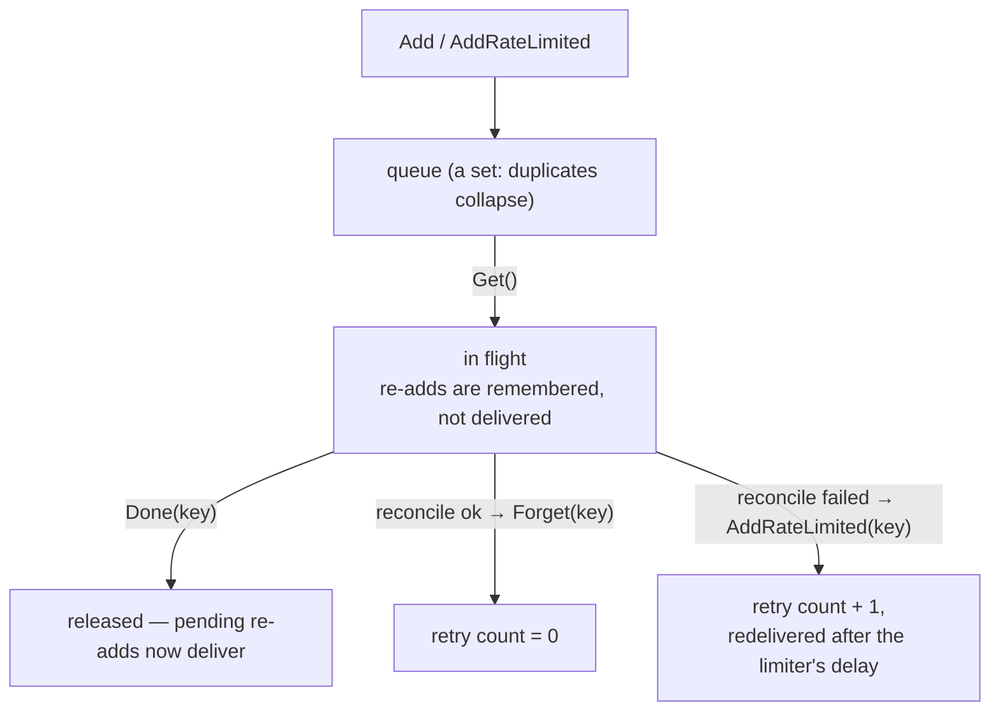

# Workqueue

[Informers](../informers/) ended with a rule: handlers enqueue a key and
return. This is the queue on the other end of that rule, and it is the piece
that decides how a controller behaves when things go wrong — which, in a
distributed system, is most of the time.

The workqueue is deliberately more than a channel. It **deduplicates**, so a
hot object updated ten times before anyone looks costs one reconcile. It
**guarantees single-flight per key**, so no two workers ever reconcile the same
object concurrently. And it carries a **per-key retry history**, so a wedged
resource backs off without slowing down anything else.

Those last two are tracked separately and released by two different calls,
`Done` and `Forget`. Confusing them is the defining bug of this topic: nothing
errors, and your controller just gets mysteriously slower, or silently stops
reconciling one object forever.

## 1. Two pieces of state, two calls

```go
key, shutdown := q.Get()
if shutdown { return }
defer q.Done(key)         // always, even on panic

if err := reconcile(key); err != nil {
	q.AddRateLimited(key) // retry with backoff
	return
}
q.Forget(key)             // success → wipe the history
```



```ascii
  processing state             retry history
  ────────────────             ─────────────
  Get()   -> in flight         AddRateLimited() -> count+1, delay = When(key)
  Done()  -> released          NumRequeues()    -> read the count
                               Forget()         -> count = 0

  Done says NOTHING about retries.  Forget says NOTHING about in-flight.
  The loop calls both.
```

Between `Get` and `Done`, re-adding the same key does not deliver it again — it
is remembered and redelivered *after* `Done`. That is what guarantees
single-flight per key. `defer q.Done(key)` is non-negotiable: miss it and the
key is stuck in flight forever, so every future add for it is silently
swallowed and that object is never reconciled again.

`Done` says nothing about retries, so a reconcile that succeeds after three
failures leaves `NumRequeues == 3`. The next failure then starts at `base·2³`
instead of `base` — a controller that gets slower and slower for a resource
that is now healthy, with no obvious cause. That is what `Forget` on success
prevents.

The `Typed*` generic constructors are the current API; the untyped
`workqueue.NewRateLimitingQueue` (items as `any`) is deprecated.

## 2. Backoff, and the limiters that do not back off

```go
rl := workqueue.NewTypedItemExponentialFailureRateLimiter[string](base, max)

d1 := rl.When("x") // base
d2 := rl.When("x") // 2·base
d3 := rl.When("x") // 4·base
```

`When(item)` is the rate limiter's whole interface: record one more failure for
that key, return how long to wait before redelivering. `AddRateLimited` is
exactly `AddAfter(item, rl.When(item))`.

The exponential limiter returns `base · 2^failures`, clamped at `max`. With a
5ms base that is 5ms, 10ms, 20ms, 40ms… A resource that fails once usually
keeps failing, and doubling means a broken object costs a handful of attempts
per minute instead of thousands. Counters are **per key**, so one wedged object
does not slow down anything else — easy to lose if you implement backoff
yourself with a single global timer.

They look interchangeable and are not:

| Limiter | Behaviour |
|---|---|
| `NewTypedItemExponentialFailureRateLimiter(base, max)` | doubles per failure — the one you want for reconcile errors |
| `NewTypedItemFastSlowRateLimiter(fast, slow, n)` | **flat** `fast` for the first `n` attempts, then flat `slow`. No doubling |
| `NewTypedMaxOfRateLimiter(...)` | composes several, takes the largest |
| `NewTypedBucketRateLimiter(rate.NewLimiter(…))` | a *global* token bucket, not per key — caps total throughput |

`workqueue.DefaultTypedControllerRateLimiter()` is a `MaxOf` of an exponential
per-item limiter (5ms → 1000s) and a 10 QPS / 100 burst global bucket: per-key
backoff *and* an overall ceiling. Unless you have a specific reason, use that.

## 3. Poison items have to be dropped

```go
func (c *Controller) handleErr(err error, key string) {
	if err == nil {
		c.queue.Forget(key)   // success: reset backoff
		return
	}
	if c.queue.NumRequeues(key) < maxRetries {
		c.queue.AddRateLimited(key) // retry with backoff
		return
	}
	c.queue.Forget(key)             // give up
	utilruntime.HandleError(err)    // and make sure a human can see why
}
```

Some failures never resolve: a malformed spec, a reference to a namespace that
does not exist, a bug in your reconcile. Backoff slows those down but never
stops them — clamped at `max`, a poison item still returns forever, holding a
worker slot and filling your logs.

Past the cap you `Forget` and do **not** re-add. Forgetting still matters even
though you are dropping the key: leave the counter high and a later update to
that object resumes at maximum backoff on its very first failure.

Dropping is safe because controllers are level-triggered. The key is gone from
the queue, but any future change to the object generates a new event and a
fresh enqueue with a clean counter. You lose the retry loop, not the object.

Dropping *silently* is the part people get wrong. Emit a Warning Event on the
object (see [watch](../watch/)) or set a `Degraded` condition on its status, so
the failure shows up in `kubectl describe` rather than only in a log line that
scrolled past.

Worth knowing where this appears upstream: `sample-controller` **does not** cap
retries at all — `AddRateLimited` on error, `Forget` on success, so a poison
item there retries forever, slowly. The capped form is what the real
controllers in `kubernetes/kubernetes` use, and both the Deployment and
EndpointSlice controllers set `maxRetries = 15`. Under the default limiter that
spans several minutes before giving up. Lean higher than feels natural —
dropping a key is permanent until something else touches the object.

## Gotchas

- **`Done` and `Forget` are unrelated.** One releases the in-flight slot, the
  other resets backoff. The loop needs both.
- **A missing `defer q.Done(key)` silently retires that key forever.**
- **No `Forget` on success means backoff never resets.** The controller decays.
- **`FastSlow` does not double.** If your backoff assertions fail, check which
  limiter you built.
- **`NewTypedBucketRateLimiter` is global, not per key.** It caps throughput,
  it is not error backoff.
- **Backoff alone never drops a poison item.** Cap with `NumRequeues`.
- **Dropping without an Event or a condition hides the failure.**
- **The untyped constructors are deprecated.** Use the `Typed*` generics.

## The exercises

- **wq1** — run the canonical loop and see what `Done` releases that `Forget`
  does not.
- **wq2** — watch the exponential limiter double, and meet the limiters that
  do not.
- **wq3** — cap retries with `NumRequeues` so a poison item is dropped instead
  of requeued forever.

## Source references

- [`client-go/util/workqueue`](https://pkg.go.dev/k8s.io/client-go/util/workqueue)
  · [`TypedRateLimitingInterface`](https://pkg.go.dev/k8s.io/client-go/util/workqueue#TypedRateLimitingInterface)
- [`util/workqueue/default_rate_limiters.go`](https://github.com/kubernetes/client-go/blob/master/util/workqueue/default_rate_limiters.go)
  — every limiter's arithmetic, in about 200 lines
- [`util/workqueue/queue.go`](https://github.com/kubernetes/client-go/blob/master/util/workqueue/queue.go)
  — dedup and the in-flight set
- [sample-controller's loop](https://github.com/kubernetes/sample-controller/blob/master/controller.go)
  (no retry cap — compare) ·
  [Deployment controller `maxRetries`](https://github.com/kubernetes/kubernetes/blob/master/pkg/controller/deployment/deployment_controller.go)
- [Writing controllers](https://github.com/kubernetes/community/blob/master/contributors/devel/sig-api-machinery/controllers.md)
- [`utilruntime.HandleError`](https://pkg.go.dev/k8s.io/apimachinery/pkg/util/runtime#HandleError)
